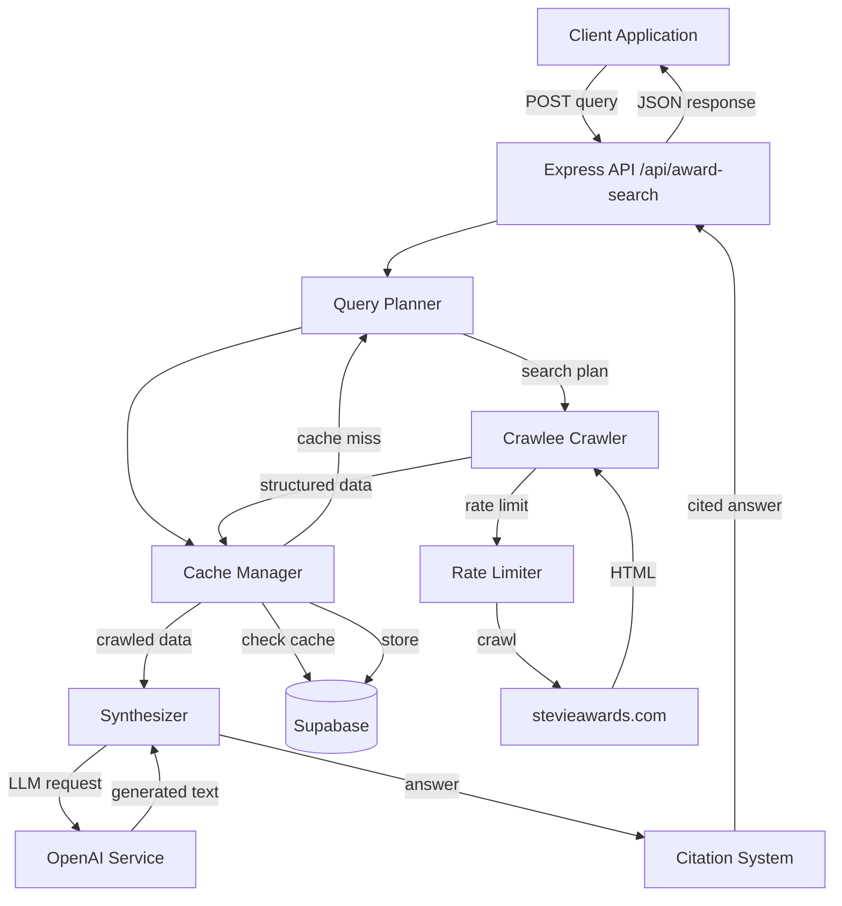

# Design Document: Award Search Assistant

## Overview

The Award Search Assistant is an intelligent search system that enables users to ask natural language questions about Stevie Awards and receive comprehensive, cited answers. The system integrates AI-powered query planning, production-grade web crawling using Crawlee, intelligent caching, and LLM-based synthesis to provide accurate, verifiable information.

### Key Design Goals

- **Scalability**: Handle 1M+ concurrent users through efficient caching and queue management
- **Reliability**: Graceful degradation when external services fail
- **Respectful Crawling**: Honor robots.txt, implement rate limiting, and avoid overwhelming target servers
- **Verifiability**: All answers include source citations for fact-checking
- **Performance**: Sub-5-second responses for cached queries, sub-15-second for new crawls
- **Integration**: Seamless integration with existing Express API, OpenAI service, and Supabase

### Technology Stack

- **Web Crawling**: Crawlee (production-grade crawler with queue management)
- **LLM Operations**: OpenAI GPT-4 via existing openaiService
- **Caching**: Supabase (PostgreSQL) with 7-day TTL
- **API Framework**: Express.js (existing)
- **Rate Limiting**: Redis-backed (existing middleware)
- **Monitoring**: Prometheus metrics (existing infrastructure)

## Architecture

### System Components



### Request Flow

1. **Query Reception**: Client sends POST request to `/api/award-search` with natural language query
2. **Query Planning**: Query Planner analyzes intent, decomposes multi-part questions, generates search strategy
3. **Cache Check**: Cache Manager checks Supabase for existing data (7-day TTL)
4. **Crawling** (if cache miss): Crawler fetches pages from stevieawards.com with rate limiting
5. **Data Extraction**: Crawler extracts structured content (title, headings, text, tables, entities)
6. **Caching**: Extracted data stored in Supabase with timestamp
7. **Synthesis**: Synthesizer uses OpenAI to generate comprehensive answer from crawled data
8. **Citation**: Citation System adds source URLs to all claims
9. **Response**: JSON response with answer, citations, and metadata returned to client

### Concurrency Model

- **Request Queue**: Up to 50 concurrent search requests queued
- **Crawl Queue**: Crawlee manages internal queue with max 3 concurrent requests to stevieawards.com
- **Cache Deduplication**: Concurrent requests for same URL share single crawl operation
- **Circuit Breaker**: OpenAI service protected by existing circuit breaker
- **Graceful Degradation**: Return cached data if crawling fails, return raw data if LLM fails

## Components and Interfaces

### 1. Query Planner

**Responsibility**: Analyze user queries and generate optimal search strategies.

**Interface**:
```typescript
interface SearchPlan {
  intent: QueryIntent;
  keywords: string[];
  targetUrls: string[];
  requiresComparison: boolean;
  entities: string[];
  priority: 'high' | 'medium' | 'low';
}

interface QueryIntent {
  type: 'category' | 'eligibility' | 'pricing' | 'deadline' | 'process' | 'comparison' | 'general';
  subQuestions: string[];
}

class QueryPlanner {
  async planSearch(query: string): Promise<SearchPlan>;
  private analyzeIntent(query: string): Promise<QueryIntent>;
  private extractKeywords(query: string): string[];
  private generateTargetUrls(intent: QueryIntent, keywords: string[]): string[];
}
```

**Implementation Details**:
- Uses OpenAI GPT-4 to analyze query intent and extract information needs
- Decomposes multi-part questions into discrete searchable components
- Generates target URL patterns based on intent (e.g., `/categories/` for category queries)
- Prioritizes cache-first strategy when possible
- Handles comparative queries by identifying all entities to compare

### 2. Crawler (Crawlee-based)

**Responsibility**: Fetch and extract content from stevieawards.com with respectful crawling practices.

**Interface**:
```typescript
interface CrawlResult {
  url: string;
  title: string;
  content: string;
  headings: string[];
  tables: TableData[];
  entities: ExtractedEntity[];
  metadata: {
    crawledAt: string;
    contentType: string;
    depth: number;
  };
}

interface CrawlerConfig {
  maxRequestsPerCrawl: number;
  maxConcurrency: number;
  requestDelay: number;
  maxDepth: number;
  userAgent: string;
}

class StevieAwardsCrawler {
  constructor(config: CrawlerConfig);
  async crawl(urls: string[]): Promise<CrawlResult[]>;
  private extractContent($: CheerioAPI): string;
  private extractTables($: CheerioAPI): TableData[];
  private extractEntities(content: string): ExtractedEntity[];
}
```

**Implementation Details**:
- Built on Crawlee's CheerioCrawler for production-grade reliability
- Respects robots.txt directives automatically
- Implements 1-second minimum delay between requests
- Max 3 concurrent requests to stevieawards.com
- Follows internal links up to 2 levels deep
- Extracts: title, headings (h1-h3), paragraphs, lists, tables, pricing info
- Normalizes text by removing excessive whitespace
- Retries failed requests up to 3 times with exponential backoff
- Preserves source URLs for all extracted information
- Custom User-Agent: "StevieAwardsSearchBot/1.0 (Award Search Assistant)"

### 3. Cache Manager

**Responsibility**: Store and retrieve crawled data with time-based expiration.

**Interface**:
```typescript
interface CachedData {
  url: string;
  data: CrawlResult;
  cachedAt: Date;
  expiresAt: Date;
}

class CacheManager {
  async get(url: string): Promise<CachedData | null>;
  async set(url: string, data: CrawlResult, ttlDays: number): Promise<void>;
  async invalidate(url: string): Promise<void>;
  async isStale(url: string): Promise<boolean>;
  async getMultiple(urls: string[]): Promise<Map<string, CachedData>>;
}
```

**Implementation Details**:
- Stores crawled data in Supabase table: `award_search_cache`
- URL as primary key for fast lookups
- 7-day TTL (configurable)
- Automatic stale detection based on timestamp
- Batch retrieval for multi-source queries
- Cache invalidation API for manual updates
- Deduplicates concurrent requests for same URL using in-memory lock

**Database Schema**:
```sql
CREATE TABLE award_search_cache (
  url TEXT PRIMARY KEY,
  data JSONB NOT NULL,
  cached_at TIMESTAMPTZ NOT NULL DEFAULT NOW(),
  expires_at TIMESTAMPTZ NOT NULL,
  access_count INTEGER DEFAULT 0,
  last_accessed_at TIMESTAMPTZ
);

CREATE INDEX idx_award_search_cache_expires ON award_search_cache(expires_at);
```

### 4. Synthesizer

**Responsibility**: Generate comprehensive answers from crawled data using LLM.

**Interface**:
```typescript
interface SynthesisResult {
  answer: string;
  sources: string[];
  confidence: 'high' | 'medium' | 'low';
  missingInfo?: string[];
}

class Synthesizer {
  async synthesize(query: string, crawledData: CrawlResult[]): Promise<SynthesisResult>;
  private buildPrompt(query: string, data: CrawlResult[]): string;
  private structureAnswer(rawAnswer: string, isComplex: boolean): string;
}
```

**Implementation Details**:
- Uses existing openaiService for LLM operations
- Combines information from multiple crawled pages
- Structures complex answers with clear sections
- Indicates missing information when data is incomplete
- Maintains factual accuracy by grounding in crawled content
- Prompt engineering to avoid hallucination
- Falls back to raw data if LLM service unavailable

**Prompt Template**:
```
You are an expert on Stevie Awards. Answer the following question using ONLY the provided information.

Question: {query}

Information from stevieawards.com:
{crawled_data}

Instructions:
- Provide a comprehensive, well-structured answer
- Use ONLY information from the provided sources
- If information is incomplete, explicitly state what is missing
- For complex questions, organize your answer with clear sections
- Be factual and precise

Answer:
```

### 5. Citation System

**Responsibility**: Track and format source URLs for all information in answers.

**Interface**:
```typescript
interface Citation {
  url: string;
  title: string;
  snippet: string;
}

interface CitedAnswer {
  answer: string;
  citations: Citation[];
  inlineCitations: Map<string, string[]>; // claim -> source URLs
}

class CitationSystem {
  async addCitations(answer: string, sources: CrawlResult[]): Promise<CitedAnswer>;
  private extractClaims(answer: string): string[];
  private mapClaimsToSources(claims: string[], sources: CrawlResult[]): Map<string, string[]>;
  private formatCitations(citations: Citation[]): string;
}
```

**Implementation Details**:
- Tracks source URL for every piece of information
- Adds inline citations as superscript numbers [1]
- Includes footnote section with full URLs and titles
- Formats citations as clickable markdown links
- Lists all relevant sources when multiple support same fact
- Ensures every claim has at least one citation
- Citation format: `[1] Category Information - https://www.stevieawards.com/categories`

### 6. Rate Limiter

**Responsibility**: Enforce respectful crawling practices and API rate limits.

**Interface**:
```typescript
interface RateLimitConfig {
  minDelayMs: number;
  maxConcurrent: number;
  exponentialBackoffBase: number;
}

class CrawlerRateLimiter {
  constructor(config: RateLimitConfig);
  async acquireSlot(domain: string): Promise<void>;
  releaseSlot(domain: string): void;
  async handleRateLimitResponse(domain: string, retryAfter?: number): Promise<void>;
}
```

**Implementation Details**:
- Minimum 1-second delay between requests to same domain
- Max 3 concurrent requests to stevieawards.com
- Honors robots.txt crawl-delay directives
- Exponential backoff on 429 responses (base: 2 seconds)
- Per-domain tracking of request timing
- Integration with Crawlee's built-in rate limiting

## Data Models

### Query Request
```typescript
interface AwardSearchRequest {
  query: string;
  userId?: string;
  sessionId?: string;
  options?: {
    forceRefresh?: boolean;
    maxDepth?: number;
  };
}
```

### Query Response
```typescript
interface AwardSearchResponse {
  success: boolean;
  answer: string;
  citations: Citation[];
  metadata: {
    cacheHit: boolean;
    responseTimeMs: number;
    sourcesUsed: number;
    queryIntent: string;
  };
  error?: {
    code: string;
    message: string;
  };
}
```

### Crawl Result
```typescript
interface CrawlResult {
  url: string;
  title: string;
  content: string;
  headings: string[];
  tables: TableData[];
  entities: ExtractedEntity[];
  metadata: {
    crawledAt: string;
    contentType: string;
    depth: number;
  };
}

interface TableData {
  headers: string[];
  rows: string[][];
}

interface ExtractedEntity {
  type: 'award' | 'category' | 'date' | 'price';
  value: string;
  context: string;
}
```

## API Endpoint Design

### POST /api/award-search

**Request**:
```json
{
  "query": "What are the eligibility requirements for the Stevie Awards for Sales & Customer Service?",
  "options": {
    "forceRefresh": false
  }
}
```

**Response (Success)**:
```json
{
  "success": true,
  "answer": "The Stevie Awards for Sales & Customer Service are open to organizations worldwide...[1]\n\nKey eligibility requirements:\n- Organizations of any size can enter[1]\n- Entries accepted from all countries[2]\n- Work must have been completed after January 1, 2023[1]\n\nCitations:\n[1] Eligibility - https://www.stevieawards.com/sales/eligibility\n[2] Entry Guidelines - https://www.stevieawards.com/sales/guidelines",
  "citations": [
    {
      "url": "https://www.stevieawards.com/sales/eligibility",
      "title": "Eligibility - Stevie Awards for Sales & Customer Service",
      "snippet": "Organizations of any size can enter..."
    }
  ],
  "metadata": {
    "cacheHit": true,
    "responseTimeMs": 1234,
    "sourcesUsed": 2,
    "queryIntent": "eligibility"
  }
}
```

**Response (Error)**:
```json
{
  "success": false,
  "error": {
    "code": "CRAWL_FAILED",
    "message": "Unable to fetch information from stevieawards.com. Please try again later."
  },
  "metadata": {
    "cacheHit": false,
    "responseTimeMs": 5678
  }
}
```

**Validation**:
- Query required, non-empty, max 1000 characters
- Options optional
- Returns 400 for invalid input
- Returns 429 for rate limit exceeded
- Returns 503 for queue full (>50 requests)

**Rate Limiting**:
- 60 requests per 15 minutes per IP (using existing chatRateLimiter pattern)
- Separate from global API rate limit

## Integration with Existing Systems

### Express API Integration
- New route: `POST /api/award-search`
- Uses existing middleware: correlationId, requestLogger, errorHandler, rateLimiter
- Follows existing error response format
- Emits metrics compatible with Prometheus

### OpenAI Service Integration
- Uses existing `openaiService.chatCompletion()` for query planning and synthesis
- Respects existing circuit breaker and retry logic
- Queues requests with `QueuePriority.QA` priority
- Tracks token usage via existing metrics

### Supabase Integration
- Uses existing `getSupabaseClient()` for database operations
- New table: `award_search_cache` (migration required)
- Follows existing connection pooling pattern
- Integrates with health check system

### Monitoring Integration
- Emits metrics via existing `metrics.ts` utilities
- New metrics:
  - `award_search_requests_total{status, cache_hit}`
  - `award_search_response_time_seconds{cache_hit}`
  - `award_search_crawl_requests_total{status}`
  - `award_search_cache_hit_rate`
  - `award_search_queue_depth`

## Caching Strategy

### Cache Key Design
- Primary key: URL (normalized)
- Composite queries use multiple cache entries

### TTL Strategy
- Default: 7 days
- Configurable per content type
- Stale-while-revalidate pattern: serve stale data while refreshing in background

### Cache Warming
- Pre-populate common queries during off-peak hours
- Priority URLs: categories, pricing, eligibility pages

### Cache Invalidation
- Time-based: automatic after 7 days
- Manual: API endpoint for admin invalidation
- Event-based: webhook from CMS (future enhancement)

### Cache Size Management
- Automatic cleanup of expired entries (daily cron job)
- LRU eviction if storage exceeds threshold
- Monitor cache hit rate and adjust TTL accordingly

## Error Handling and Resilience

### Error Categories

1. **Crawl Failures**
   - Retry up to 3 times with exponential backoff
   - Fall back to cached data if available
   - Return partial answer with disclaimer

2. **LLM Service Failures**
   - Circuit breaker prevents cascading failures
   - Fall back to raw crawled data with citations
   - Queue request for retry when service recovers

3. **Cache Failures**
   - Log error and proceed with crawling
   - Graceful degradation: system works without cache
   - Alert on repeated cache failures

4. **Rate Limit Exceeded**
   - Return 429 with Retry-After header
   - Queue request if within capacity
   - Suggest alternative: browse website directly

5. **Invalid Queries**
   - Return 400 with helpful error message
   - Suggest query reformulation
   - Log for query pattern analysis

### Resilience Patterns

**Circuit Breaker**: Protect OpenAI service (existing implementation)

**Retry with Backoff**: Crawl failures, transient errors

**Timeout**: 30s for crawl operations, 30s for LLM operations

**Graceful Degradation**:
- Crawl fails → use cached data
- LLM fails → return raw data
- Cache fails → proceed without cache

**Request Queuing**: Handle burst traffic up to 50 concurrent requests

**Health Checks**: Monitor crawler, cache, and LLM service health

## Correctness Properties

*A property is a characteristic or behavior that should hold true across all valid executions of a system—essentially, a formal statement about what the system should do. Properties serve as the bridge between human-readable specifications and machine-verifiable correctness guarantees.*

### Property 1: Query Length Validation
*For any* input string, queries under 1000 characters should be accepted and queries over 1000 characters should be rejected with a validation error.
**Validates: Requirements 1.1**

### Property 2: Query Planner Output Structure
*For any* valid query, the Query Planner should produce a SearchPlan with non-empty intent, keywords, and targetUrls arrays.
**Validates: Requirements 1.2, 2.4, 2.5**

### Property 3: Multi-Question Decomposition
*For any* query containing multiple questions (identified by multiple question marks or conjunctions), the Query Planner should produce a SearchPlan with multiple subQuestions.
**Validates: Requirements 1.3**

### Property 4: Cache-First Strategy
*For any* query where cached data exists and is not stale, the Query Planner should prioritize cached data over generating new crawl targets.
**Validates: Requirements 2.3**

### Property 5: Comparative Query Handling
*For any* query containing comparative language ("difference between", "compare", "versus"), the Query Planner should identify multiple entities and set requiresComparison to true.
**Validates: Requirements 2.2**

### Property 6: Crawl Request Delays
*For any* sequence of crawl requests to the same domain, consecutive requests should have at least 1000ms delay between them.
**Validates: Requirements 3.3, 8.1**

### Property 7: Concurrent Request Limit
*For any* time window, the number of concurrent requests to stevieawards.com should never exceed 3.
**Validates: Requirements 3.6, 8.2**

### Property 8: Retry with Exponential Backoff
*For any* failed crawl request, the system should retry up to 3 times with delays following exponential backoff (1s, 2s, 4s).
**Validates: Requirements 3.5**

### Property 9: Link Following Depth Limit
*For any* crawl operation, the crawler should not follow links beyond depth 2 from the initial URL.
**Validates: Requirements 3.7**

### Property 10: Source URL Preservation
*For any* crawled content, the CrawlResult should include the source URL in the metadata.
**Validates: Requirements 3.8**

### Property 11: Content Extraction Completeness
*For any* successfully crawled page, the CrawlResult should contain non-empty title, content, and headings arrays.
**Validates: Requirements 4.1, 4.4**

### Property 12: Text Normalization
*For any* extracted text content, the normalized text should not contain sequences of more than 2 consecutive whitespace characters.
**Validates: Requirements 4.3**

### Property 13: Entity Extraction
*For any* page containing award names, category names, or dates in standard formats, the Crawler should extract them as entities.
**Validates: Requirements 4.5**

### Property 14: Multi-Source Synthesis
*For any* synthesis operation with multiple CrawlResults, the generated answer should reference information from all provided sources.
**Validates: Requirements 5.2**

### Property 15: Structured Answer Format
*For any* query with multiple subQuestions, the synthesized answer should contain section markers or headings.
**Validates: Requirements 5.4**

### Property 16: Missing Information Indication
*For any* synthesis operation where crawled data is incomplete (empty content or missing key fields), the answer should explicitly state what information is missing.
**Validates: Requirements 5.5**

### Property 17: Citation Tracking
*For any* generated answer, every factual claim should have at least one associated source URL in the citations array.
**Validates: Requirements 6.1, 6.5**

### Property 18: Citation Format
*For any* citation in the response, it should be formatted as a valid URL with descriptive text.
**Validates: Requirements 6.2, 6.3**

### Property 19: Multi-Source Citation
*For any* fact supported by multiple sources, all relevant source URLs should be listed in the citations.
**Validates: Requirements 6.4**

### Property 20: Cache Storage with URL Key
*For any* crawled content, storing it in the cache should use the normalized URL as the primary key.
**Validates: Requirements 7.1**

### Property 21: Cache Check Before Crawl
*For any* search operation, the Cache Manager should check for cached data before initiating new crawl requests.
**Validates: Requirements 7.2**

### Property 22: Cache Timestamp Storage
*For any* cached entry, it should include both cachedAt and expiresAt timestamps.
**Validates: Requirements 7.3**

### Property 23: Stale Data Detection
*For any* cached entry where (current time - cachedAt) > 7 days, the Cache Manager should mark it as stale.
**Validates: Requirements 7.4**

### Property 24: Cache Invalidation
*For any* URL, calling invalidate() should remove the entry from the cache.
**Validates: Requirements 7.5**

### Property 25: Cached Response Time
*For any* query that hits the cache, the response time should be under 5 seconds.
**Validates: Requirements 7.6**

### Property 26: Uncached Response Time
*For any* query requiring new crawls, the response time should be under 15 seconds.
**Validates: Requirements 7.7**

### Property 27: User-Agent Header
*For any* crawl request, the HTTP headers should include a User-Agent identifying the bot.
**Validates: Requirements 8.4**

### Property 28: 429 Response Backoff
*For any* 429 (Too Many Requests) response, subsequent retry delays should increase exponentially.
**Validates: Requirements 8.5**

### Property 29: Input Validation
*For any* request with missing or empty query parameter, the API should return 400 Bad Request.
**Validates: Requirements 9.2**

### Property 30: Response Format
*For any* successful response, it should be valid JSON containing answer, citations, and metadata fields.
**Validates: Requirements 9.5**

### Property 31: Concurrent Query Processing
*For any* set of concurrent queries, they should be processed in parallel without blocking each other.
**Validates: Requirements 10.1**

### Property 32: Crawl Request Deduplication
*For any* set of concurrent queries requesting the same URL, only one crawl operation should be initiated.
**Validates: Requirements 10.2**

### Property 33: Request Queuing
*For any* load exceeding capacity, requests should be queued rather than rejected immediately.
**Validates: Requirements 10.3**

### Property 34: Queue Depth Limit
*For any* queue depth exceeding 50 requests, new requests should receive 503 Service Unavailable.
**Validates: Requirements 10.4**

### Property 35: Concurrent Load Performance
*For any* concurrent load of 100 queries, the median response time should remain within SLA thresholds.
**Validates: Requirements 10.5**

### Property 36: Graceful Crawl Failure
*For any* crawl failure after retries, if cached data exists, the system should return a partial answer with cached data.
**Validates: Requirements 11.1**

### Property 37: LLM Fallback
*For any* LLM service failure, the system should return raw crawled data with citations instead of failing completely.
**Validates: Requirements 11.3**

### Property 38: Unanswerable Query Handling
*For any* query that cannot be answered (no relevant data found), the response should include an explanation and suggested alternatives.
**Validates: Requirements 11.4**

### Property 39: Error Logging
*For any* error condition, the system should log the error with context including query, error type, and stack trace.
**Validates: Requirements 11.5**

### Property 40: Success Rate Tracking
*For any* query, the system should increment either success or failure counters for metrics tracking.
**Validates: Requirements 12.1**

### Property 41: Response Time Measurement
*For any* query, the system should measure and record response time, tagged by cache hit status.
**Validates: Requirements 12.2**

### Property 42: Query Pattern Logging
*For any* query, the system should log the query text and intent for pattern analysis.
**Validates: Requirements 12.3**

### Property 43: Cache Hit Rate Tracking
*For any* query, the system should track whether it was a cache hit or miss for hit rate calculation.
**Validates: Requirements 12.4**

## Testing Strategy

### Dual Testing Approach

The system requires both unit tests and property-based tests for comprehensive coverage:

- **Unit Tests**: Verify specific examples, edge cases, error conditions, and integration points
- **Property Tests**: Verify universal properties across all inputs through randomization

Together, these approaches provide comprehensive coverage where unit tests catch concrete bugs and property tests verify general correctness.

### Property-Based Testing

**Framework**: fast-check (TypeScript property-based testing library)

**Configuration**:
- Minimum 100 iterations per property test
- Each test tagged with: `Feature: award-search-assistant, Property {N}: {property_text}`
- Randomized inputs: queries, URLs, crawl results, cache states

**Key Property Tests**:
1. Query validation (length limits, format)
2. Cache behavior (hit/miss, staleness, deduplication)
3. Rate limiting (delays, concurrency, backoff)
4. Citation completeness (every claim has source)
5. Response format (valid JSON, required fields)
6. Error handling (graceful degradation, fallbacks)
7. Concurrent operations (no race conditions, proper queuing)

### Unit Testing

**Framework**: Jest

**Focus Areas**:
- Query Planner intent detection for specific query types
- Crawler extraction for known page structures
- Cache Manager TTL calculations
- Synthesizer prompt construction
- Citation System formatting
- Rate Limiter backoff calculations
- API endpoint validation and error responses
- Integration with OpenAI service
- Integration with Supabase

**Edge Cases**:
- Empty query results
- Malformed HTML
- Network timeouts
- Cache failures
- LLM service unavailable
- Queue overflow
- Concurrent cache access

### Integration Testing

**Scenarios**:
1. End-to-end query flow (query → plan → crawl → synthesize → respond)
2. Cache hit path (query → cache → synthesize → respond)
3. Multi-source synthesis (query → multiple crawls → combined answer)
4. Error recovery (crawl fails → use cache → partial answer)
5. Rate limit enforcement (rapid requests → 429 responses)
6. Concurrent query handling (100 simultaneous queries)

### Performance Testing

**Load Tests**:
- 100 concurrent queries (requirement threshold)
- 1000 concurrent queries (stress test)
- Cache hit rate under load
- Response time distribution (p50, p95, p99)
- Queue depth monitoring

**Benchmarks**:
- Cache hit response time < 5s
- Uncached response time < 15s
- Crawler throughput (pages/second)
- Memory usage under load

### Test Data

**Mock Responses**:
- Sample stevieawards.com pages (categories, eligibility, pricing)
- Various HTML structures (tables, lists, nested content)
- robots.txt files with different directives

**Generated Test Cases**:
- Random queries (various lengths, intents, complexity)
- Random URLs (valid, invalid, edge cases)
- Random cache states (hit, miss, stale)
- Random error conditions (timeouts, 429s, 500s)

## Deployment Considerations

### Environment Variables
```
OPENAI_API_KEY=<existing>
SUPABASE_URL=<existing>
SUPABASE_SERVICE_ROLE_KEY=<existing>
AWARD_SEARCH_CACHE_TTL_DAYS=7
AWARD_SEARCH_MAX_QUEUE_DEPTH=50
AWARD_SEARCH_CRAWLER_CONCURRENCY=3
AWARD_SEARCH_CRAWLER_DELAY_MS=1000
```

### Database Migration
```sql
-- Run migration to create award_search_cache table
-- See schema in Cache Manager section
```

### Monitoring Alerts
- Cache hit rate < 50% (investigate common queries)
- Response time p95 > 10s (performance degradation)
- Error rate > 5% (system health issue)
- Queue depth > 40 (approaching capacity)
- Crawler 429 responses (rate limit issues)

### Scaling Considerations
- Horizontal scaling: stateless design allows multiple API instances
- Cache: Supabase handles connection pooling
- Crawler: Crawlee queue can be externalized to Redis for distributed crawling
- LLM: existing OpenAI service queue handles load distribution

