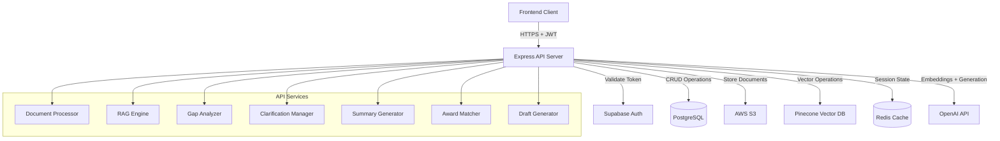
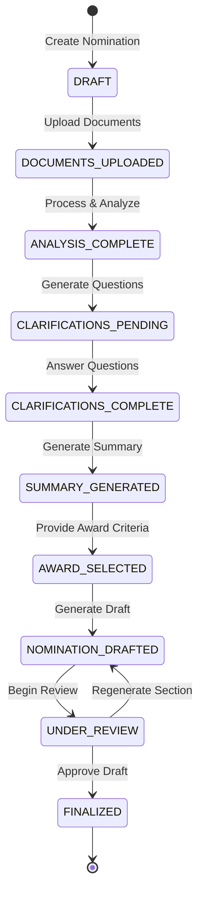
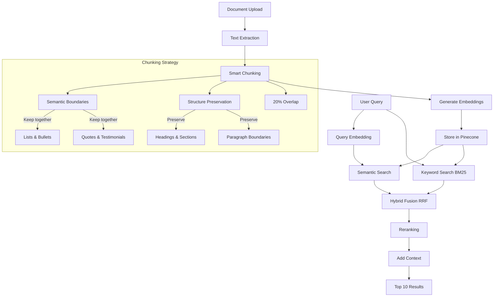

# Design Document: Nomination Assistant

## Overview

The Nomination Assistant is an AI-powered system that automates the creation of award nominations through a multi-stage RAG (Retrieval-Augmented Generation) pipeline. The system processes uploaded documents, extracts structured information, identifies gaps, conducts conversational clarifications, and generates professional nomination drafts matched to specific award criteria.

### Key Design Principles

1. **Separation of Concerns**: Document processing, RAG retrieval, gap analysis, and draft generation are independent, composable services
2. **User Namespace Isolation**: All vector embeddings are stored in user-specific Pinecone namespaces for complete data isolation
3. **Stateful Workflow**: Nomination progress is tracked through explicit state transitions, enabling resume-from-anywhere capability
4. **Human-in-the-Loop**: Critical review points ensure accuracy and allow user refinement before finalization
5. **Async-First Architecture**: Long-running operations (embedding generation, LLM calls) are processed asynchronously with progress tracking
6. **Idempotency**: All operations are designed to be safely retryable without side effects

### Technology Stack

- **Runtime**: Node.js 18+ with TypeScript
- **API Framework**: Express.js with middleware for auth, rate limiting, validation
- **Database**: PostgreSQL (Supabase) for structured data, JSONB for flexible schemas
- **Vector Store**: Pinecone for document embeddings with namespace isolation
- **Object Storage**: AWS S3 for document storage with server-side encryption
- **Cache**: Redis for session state and temporary data
- **LLM Services**: OpenAI GPT-4 for generation, text-embedding-3-small for embeddings
- **Document Parsing**: pdf-parse (PDF), mammoth (DOCX), pptxgenjs (PPTX)
- **Authentication**: Supabase Auth with JWT validation

## Architecture

### System Architecture Diagram



### Workflow State Machine




## Components and Interfaces

### 1. Document Processor Service

**Responsibility**: Handle document upload, storage, text extraction, chunking, and embedding generation.

**Interface**:
```typescript
interface DocumentProcessorService {
  uploadDocument(
    nominationId: string,
    file: Express.Multer.File,
    userId: string
  ): Promise<DocumentMetadata>;
  
  extractText(
    s3Key: string,
    fileType: string
  ): Promise<ExtractedText>;
  
  chunkDocument(
    text: string,
    documentId: string
  ): Promise<DocumentChunk[]>;
  
  generateEmbeddings(
    chunks: DocumentChunk[],
    userId: string
  ): Promise<void>;
  
  deleteDocument(
    documentId: string,
    userId: string
  ): Promise<void>;
  
  listDocuments(
    nominationId: string,
    userId: string
  ): Promise<DocumentMetadata[]>;
}

interface DocumentMetadata {
  id: string;
  nominationId: string;
  filename: string;
  fileType: string;
  fileSize: number;
  s3Key: string;
  uploadDate: Date;
}

interface ExtractedText {
  content: string;
  metadata: {
    pageCount?: number;
    wordCount: number;
    hasFormatting: boolean;
  };
}

interface DocumentChunk {
  documentId: string;
  chunkIndex: number;
  text: string;
  tokenCount: number;
  startOffset: number;
  endOffset: number;
}
```

**Implementation Details**:
- Use S3 presigned URLs for direct client-to-S3 uploads (bypasses server, reduces latency)
  - Generate presigned PUT URL with 15-minute expiration
  - Client uploads directly to S3 using presigned URL
  - Webhook/polling to detect upload completion
  - Prevents server bottleneck and enables parallel uploads
- Fallback: Use `multer` for traditional server upload if presigned URLs fail
- Store original files in S3 with path pattern: `nominations/{userId}/{nominationId}/{documentId}/{filename}`
- Enable S3 server-side encryption (SSE-S3) for all uploads
- Use format-specific parsers:
  - PDF: `pdf-parse` library
  - DOCX: `mammoth` library with style preservation
  - PPTX: `pptxgenjs` or `officegen` for slide extraction
  - TXT: Direct UTF-8 reading

**Structure Detection Strategy**:

Each document format has different structure indicators that we detect and preserve:

1. **PDF Structure Detection**:
   - Font size changes → Likely headings (larger font = higher-level heading)
   - Bold/italic text → Emphasis or subheadings
   - Page breaks → Natural section boundaries
   - Whitespace patterns → Paragraph boundaries
   - Bullet characters (•, -, *, numbers) → Lists
   - Example: If line has font size 18pt while body is 12pt → Mark as heading

2. **DOCX Structure Detection**:
   - Built-in styles (Heading 1, Heading 2, etc.) → Direct heading detection
   - Paragraph styles → Section boundaries
   - List numbering/bullets → List detection
   - Tables → Keep table rows together
   - Example: `mammoth` library extracts style metadata directly

3. **PPTX Structure Detection**:
   - Slide titles → Top-level sections
   - Slide boundaries → Natural chunk boundaries
   - Text boxes → Content grouping
   - Each slide is treated as a semantic unit
   - Example: Slide 1 title becomes heading, slide content becomes body

4. **TXT Structure Detection** (Heuristic-based):
   - Lines in ALL CAPS → Likely headings
   - Lines ending with colon → Likely section headers
   - Empty lines → Paragraph boundaries
   - Lines starting with numbers/bullets → Lists
   - Indentation patterns → Nested structure
   - Example: "ACHIEVEMENTS:" followed by indented lines → Section with list

**Adaptive Chunking Algorithm**:

```typescript
function chunkDocument(text: string, metadata: DocumentMetadata): DocumentChunk[] {
  // 1. Detect structure markers
  const structure = detectStructure(text, metadata.fileType);
  
  // 2. Create semantic boundaries
  const boundaries = [
    ...structure.headings.map(h => h.position),
    ...structure.paragraphs.map(p => p.end),
    ...structure.lists.map(l => l.end)
  ].sort();
  
  // 3. Chunk with awareness of boundaries
  const chunks: DocumentChunk[] = [];
  let currentChunk = '';
  let currentTokens = 0;
  
  for (const segment of splitByBoundaries(text, boundaries)) {
    const segmentTokens = countTokens(segment);
    
    // If adding this segment exceeds max tokens, finalize current chunk
    if (currentTokens + segmentTokens > 800 && currentTokens >= 400) {
      chunks.push(createChunk(currentChunk, metadata));
      // Start new chunk with 20% overlap from previous
      currentChunk = getOverlap(currentChunk, 0.2) + segment;
      currentTokens = countTokens(currentChunk);
    } else {
      currentChunk += segment;
      currentTokens += segmentTokens;
    }
  }
  
  return chunks;
}

function detectStructure(text: string, fileType: string): DocumentStructure {
  switch (fileType) {
    case 'pdf':
      return detectPDFStructure(text); // Uses font size, formatting
    case 'docx':
      return detectDOCXStructure(text); // Uses built-in styles
    case 'pptx':
      return detectPPTXStructure(text); // Uses slide boundaries
    case 'txt':
      return detectTXTStructure(text); // Uses heuristics
  }
}
```

**Fallback Strategy**:

If structure detection fails or produces poor results:
1. Fall back to simple paragraph-based chunking (split on `\n\n`)
2. Use fixed-size sliding window (600 tokens, 20% overlap)
3. Apply sentence boundary detection to avoid mid-sentence splits
4. Still works, just less optimal for retrieval

**Why This Works**:

- We don't need perfect structure detection
- Even basic structure awareness (paragraphs, headings) significantly improves retrieval
- The overlap ensures context isn't lost at boundaries
- Hybrid search (semantic + keyword) compensates for imperfect chunking
- Reranking step fixes ordering issues from chunking artifacts

**Metadata Enrichment**:

Each chunk stores detected structure info:
```typescript
interface ChunkMetadata {
  documentId: string;
  chunkIndex: number;
  text: string;
  structureType: 'heading' | 'paragraph' | 'list' | 'table' | 'unknown';
  sectionHeading?: string; // Nearest preceding heading
  pageNumber?: number; // For PDFs
  slideNumber?: number; // For PPTX
  relativePosition: 'beginning' | 'middle' | 'end'; // Position in document
}
```

This metadata helps during retrieval - we can prefer chunks from relevant sections.
- Chunking strategy:
  - Use `tiktoken` library for accurate token counting (cl100k_base encoding)
  - Target chunk size: 400-800 tokens
  - Overlap: 20% (80-160 tokens)
  - **Document-aware chunking**: Preserve document structure by:
    - Identifying section boundaries (headings, page breaks)
    - Preserving paragraph boundaries using regex: `/\n\n+/`
    - Avoiding mid-sentence splits using sentence boundary detection (`.!?` followed by space/newline)
    - Keeping bullet points and lists together when possible
  - **Semantic chunking**: Group related content together:
    - Keep achievement descriptions with their metrics
    - Keep dates with their associated events
    - Keep testimonials/quotes as complete units
  - **Metadata enrichment**: Each chunk includes:
    - Document section/heading context
    - Page number (for PDFs)
    - Relative position in document (beginning/middle/end)
- Embedding generation:
  - Batch chunks in groups of 100-2048 for API efficiency (OpenAI max batch size: 2048)
  - Use OpenAI `text-embedding-3-small` model (1536 dimensions)
  - Implement exponential backoff for rate limit errors (429 responses)
  - For non-urgent processing (>1000 chunks), consider Batch API (50% cost savings, up to 24h processing)
  - Store in Pinecone namespace: `user_{userId}_nominations`
  - Metadata: `{documentId, chunkIndex, nominationId, filename, text, tokenCount, uploadDate}`

**Document Deletion Strategy**:

When a user deletes a document, we need to clean up three places:

1. **Database**: Delete record from `nomination_documents` table
2. **S3**: Delete the original file from object storage
3. **Pinecone**: Delete all embedding chunks for that document

**Implementation**:
```typescript
async deleteDocument(documentId: string, userId: string): Promise<void> {
  // 1. Get document metadata (includes s3_key and nomination_id)
  const doc = await db.query(
    'SELECT * FROM nomination_documents WHERE id = $1',
    [documentId]
  );
  
  if (!doc.rows[0]) {
    throw new NotFoundError('Document not found');
  }
  
  // 2. Verify ownership through nomination
  const nomination = await db.query(
    'SELECT user_id FROM nominations WHERE id = $1',
    [doc.rows[0].nomination_id]
  );
  
  if (nomination.rows[0].user_id !== userId) {
    throw new ForbiddenError('Not authorized to delete this document');
  }
  
  // 3. Delete from S3
  await s3Client.deleteObject({
    Bucket: process.env.S3_BUCKET,
    Key: doc.rows[0].s3_key
  });
  
  // 4. Delete embeddings from Pinecone
  // Query Pinecone for all chunks with this documentId
  const namespace = `user_{userId}_nominations`;
  await pineconeIndex.namespace(namespace).deleteMany({
    filter: {
      documentId: { $eq: documentId }
    }
  });
  
  // 5. Delete database record (this cascades to related tables if any)
  await db.query(
    'DELETE FROM nomination_documents WHERE id = $1',
    [documentId]
  );
  
  // 6. Log deletion for audit
  await db.query(
    'INSERT INTO nomination_audit_log (nomination_id, user_id, operation, details) VALUES ($1, $2, $3, $4)',
    [doc.rows[0].nomination_id, userId, 'document_deleted', { documentId, filename: doc.rows[0].filename }]
  );
}
```

**Tracking Chunks for Deletion**:

The `nomination_documents` table already has a primary key (`id`) that we use as `documentId`. This is stored in Pinecone metadata for each chunk:

```typescript
interface PineconeMetadata {
  nominationId: string;
  documentId: string; // ← This is the primary key from nomination_documents table
  chunkIndex: number;
  filename: string;
  text: string;
  tokenCount: number;
  uploadDate: string;
}
```

When deleting, we filter by `documentId` in Pinecone to remove all chunks from that document. No additional tracking table needed - the document ID is sufficient.

### 2. RAG Engine Service

**Responsibility**: Perform semantic search over document chunks using hybrid retrieval.

**Chunking and Retrieval Pipeline**:



**Interface**:
```typescript
interface RAGEngineService {
  retrieveRelevantChunks(
    query: string,
    userId: string,
    nominationId: string,
    topK?: number
  ): Promise<RetrievedChunk[]>;
  
  hybridSearch(
    semanticResults: RetrievedChunk[],
    keywordResults: RetrievedChunk[]
  ): Promise<RetrievedChunk[]>;
  
  rerankResults(
    chunks: RetrievedChunk[],
    query: string
  ): Promise<RetrievedChunk[]>;
}

interface RetrievedChunk {
  documentId: string;
  chunkIndex: number;
  text: string;
  score: number;
  metadata: {
    filename: string;
    nominationId: string;
  };
}
```

**Implementation Details**:

**Retrieval Strategy - Multi-Stage Pipeline**:

1. **Query Understanding**:
   - Analyze the query type (e.g., "nominee information", "impact metrics", "timeline")
   - Expand query with synonyms and related terms
   - Generate query embedding using text-embedding-3-small

2. **Stage 1: Semantic Search** (Pinecone):
   - Query Pinecone with filters: `{nominationId: {$eq: nominationId}}`
   - Retrieve top 20 candidates based on cosine similarity
   - Use metadata filters when applicable (e.g., document type, section)

3. **Stage 2: Keyword Search** (BM25):
   - Build in-memory BM25 index of chunk texts for the nomination
   - Perform keyword search for exact term matches
   - Retrieve top 20 candidates
   - Particularly useful for:
     - Specific names, dates, numbers
     - Technical terms and acronyms
     - Exact phrases from award criteria

4. **Stage 3: Hybrid Fusion**:
   - Combine semantic and keyword results using Reciprocal Rank Fusion (RRF)
   - Formula: `score(chunk) = Σ(1 / (k + rank_i))` where k=60
   - This balances semantic understanding with exact matches

5. **Stage 4: Reranking**:
   - Use cross-encoder model (e.g., `cross-encoder/ms-marco-MiniLM-L-6-v2`) or
   - LLM-based relevance scoring for top 20 results
   - Rerank based on query-chunk relevance
   - Select final top 10 chunks

6. **Stage 5: Context Enhancement**:
   - For each retrieved chunk, include:
     - Previous chunk (for context continuity)
     - Next chunk (for context continuity)
     - Document metadata (filename, section, page)
   - This provides richer context for LLM processing

**Retrieval Basis - What We Search For**:

The system performs different retrieval queries based on the task:

1. **Gap Analysis Queries**:
   - "nominee name, title, and organization"
   - "quantifiable impact metrics and results"
   - "timeline of achievements and dates"
   - "awards, recognition, and testimonials"
   - "innovation and unique factors"

2. **Summary Generation Queries**:
   - "key achievements and accomplishments"
   - "measurable business impact"
   - "leadership and innovation examples"
   - "supporting evidence and validation"

3. **Draft Generation Queries**:
   - Award-specific criteria (e.g., "demonstrates exceptional innovation")
   - Section-specific content (e.g., "achievement details", "impact results")
   - Citation retrieval for factual claims

**Optimization Techniques**:

- **Caching**: Cache retrieval results in Redis (TTL: 1 hour) for repeated queries
- **Batch Processing**: Retrieve for multiple queries in parallel
- **Adaptive Retrieval**: Adjust topK based on result quality (if top results have low scores, retrieve more)
- **Fallback Strategy**: If hybrid search times out (>2s), fall back to semantic-only search

**Quality Metrics**:
- Track retrieval precision: % of retrieved chunks actually used in generation
- Monitor retrieval latency: p50, p95, p99
- Measure user feedback: implicit (edits to generated content) and explicit (ratings)

### 3. Gap Analyzer Service

**Responsibility**: Identify missing information by comparing extracted content against nomination requirements.

**Interface**:
```typescript
interface GapAnalyzerService {
  analyzeGaps(
    nominationId: string,
    userId: string
  ): Promise<GapAnalysisResult>;
  
  calculateConfidenceScore(
    requirement: RequirementType,
    retrievedChunks: RetrievedChunk[]
  ): Promise<number>;
}

interface GapAnalysisResult {
  nominationId: string;
  requirements: RequirementAnalysis[];
  overallCompleteness: number;
  analyzedAt: Date;
}

interface RequirementAnalysis {
  type: RequirementType;
  confidenceScore: number;
  status: 'complete' | 'partial' | 'missing';
  priority: 'critical' | 'important' | 'optional';
  extractedInfo?: string;
  needsClarification: boolean;
}

enum RequirementType {
  NOMINEE_INFO = 'nominee_info',
  ACHIEVEMENT_DESCRIPTION = 'achievement_description',
  IMPACT_METRICS = 'impact_metrics',
  TIMELINE = 'timeline',
  SUPPORTING_EVIDENCE = 'supporting_evidence',
  INNOVATION_FACTORS = 'innovation_factors'
}
```

**Implementation Details**:
- For each requirement type, generate targeted queries (e.g., "nominee name and title", "quantifiable impact metrics")
- Retrieve relevant chunks using RAG engine
- Use LLM to extract structured information from chunks
- Calculate confidence score based on:
  - Information completeness (0-0.4)
  - Source quality (0-0.3)
  - Specificity (0-0.3)
- Threshold for clarification: confidence < 0.7
- Priority assignment:
  - Critical: nominee_info, achievement_description
  - Important: impact_metrics, timeline
  - Optional: innovation_factors
- Cache results in Redis with TTL of 1 hour


### 4. Clarification Manager Service

**Responsibility**: Generate targeted questions for gaps and manage user responses.

**Interface**:
```typescript
interface ClarificationManagerService {
  generateQuestions(
    gapAnalysis: GapAnalysisResult,
    userId: string
  ): Promise<ClarificationQuestion[]>;
  
  submitAnswer(
    nominationId: string,
    questionId: string,
    answer: string,
    userId: string
  ): Promise<void>;
  
  getNextQuestions(
    nominationId: string,
    userId: string,
    batchSize?: number
  ): Promise<ClarificationQuestion[]>;
  
  checkCompleteness(
    nominationId: string
  ): Promise<boolean>;
}

interface ClarificationQuestion {
  id: string;
  nominationId: string;
  requirementType: RequirementType;
  question: string;
  context?: string;
  priority: 'critical' | 'important' | 'optional';
  isOptional: boolean;
  answered: boolean;
  answer?: string;
  answeredAt?: Date;
}
```

**Implementation Details**:
- Question generation using GPT-4 with context from retrieved chunks
- Prompt template includes:
  - Requirement type
  - Extracted partial information
  - Specific gaps identified
  - Instruction to be specific and actionable
- Question grouping logic:
  - Group related questions (e.g., all timeline questions together)
  - Maximum 3 questions per batch
  - Present critical questions first
- Store questions in `nomination_clarifications` table
- Update confidence scores after answers:
  - Answered critical question: +0.3 to confidence
  - Answered important question: +0.2 to confidence
  - Answered optional question: +0.1 to confidence
- Completeness check: all critical questions answered

### 5. Summary Generator Service

**Responsibility**: Synthesize candidate profile from documents and clarifications.

**Interface**:
```typescript
interface SummaryGeneratorService {
  generateSummary(
    nominationId: string,
    userId: string
  ): Promise<CandidateSummary>;
  
  updateSummary(
    nominationId: string,
    updates: Partial<CandidateSummary>,
    userId: string
  ): Promise<CandidateSummary>;
}

interface CandidateSummary {
  nominationId: string;
  version: number;
  executiveSummary: string;
  keyAchievements: Achievement[];
  impactMetrics: ImpactMetric[];
  timeline: TimelineEvent[];
  supportingEvidence: Evidence[];
  uniqueDifferentiators: string[];
  generatedAt: Date;
}

interface Achievement {
  title: string;
  description: string;
  category: string;
  sources: string[];
}

interface ImpactMetric {
  metric: string;
  value: string;
  context: string;
  sources: string[];
}

interface TimelineEvent {
  date: string;
  event: string;
  significance: string;
}

interface Evidence {
  type: 'award' | 'recognition' | 'testimonial' | 'publication' | 'other';
  description: string;
  source: string;
}
```

**Implementation Details**:
- Map-reduce strategy for long documents:
  - Map phase: Summarize each document independently using GPT-4
  - Reduce phase: Combine summaries into unified profile
- Retrieval strategy:
  - Query for each section (achievements, metrics, timeline, etc.)
  - Retrieve top 10 chunks per section
  - Pass to LLM with structured output format (JSON mode)
- Prompt engineering:
  - Use few-shot examples for consistent formatting
  - Instruct to include source citations (document name + chunk)
  - Emphasize quantifiable metrics and specific dates
- Store in `nomination_summaries` table as JSONB
- Version increment on each update
- Timeout: 30 seconds with retry logic

### 6. Award Matcher Service

**Responsibility**: Compare candidate profile against award criteria and generate match analysis.

**Interface**:
```typescript
interface AwardMatcherService {
  matchAward(
    nominationId: string,
    awardCriteria: string,
    userId: string
  ): Promise<AwardMatchResult>;
  
  explainMatch(
    candidateSummary: CandidateSummary,
    awardCriteria: string
  ): Promise<MatchExplanation>;
}

interface AwardMatchResult {
  nominationId: string;
  matchScore: number; // 0-100
  explanation: MatchExplanation;
  matchedAt: Date;
}

interface MatchExplanation {
  overallFit: string;
  strongMatches: CriteriaMatch[];
  weaknesses: CriteriaMatch[];
  recommendations: string[];
}

interface CriteriaMatch {
  criterion: string;
  candidateEvidence: string;
  matchStrength: 'strong' | 'moderate' | 'weak';
  sources: string[];
}
```

**Implementation Details**:
- Embed award criteria using text-embedding-3-small
- Compute cosine similarity between:
  - Award criteria embedding
  - Candidate summary embedding (embed the full JSON as text)
- Normalize similarity to 0-100 scale: `matchScore = similarity * 100`
- Generate explanation using GPT-4:
  - Input: candidate summary + award criteria
  - Output: structured JSON with strong matches, weaknesses, recommendations
  - Prompt: "Analyze how well this candidate matches the award criteria. Identify specific evidence for each criterion."
- Cache match results in Redis (TTL: 1 hour)
- Store in database for historical tracking

### 7. Draft Generator Service

**Responsibility**: Generate complete nomination document from all gathered information.

**Interface**:
```typescript
interface DraftGeneratorService {
  generateDraft(
    nominationId: string,
    userId: string,
    formatRequirements?: string
  ): Promise<NominationDraft>;
  
  regenerateSection(
    draftId: string,
    section: DraftSection,
    userId: string
  ): Promise<NominationDraft>;
  
  updateDraft(
    draftId: string,
    content: string,
    userId: string
  ): Promise<NominationDraft>;
  
  exportDraft(
    draftId: string,
    format: 'docx' | 'pdf' | 'txt' | 'markdown',
    userId: string
  ): Promise<Buffer>;
}

interface NominationDraft {
  id: string;
  nominationId: string;
  version: number;
  content: string; // Markdown format
  sections: DraftSectionContent[];
  awardCriteria: string;
  generatedAt: Date;
}

interface DraftSectionContent {
  section: DraftSection;
  content: string;
  citations: Citation[];
}

enum DraftSection {
  INTRODUCTION = 'introduction',
  ACHIEVEMENT_DETAILS = 'achievement_details',
  IMPACT_RESULTS = 'impact_results',
  SUPPORTING_EVIDENCE = 'supporting_evidence',
  CONCLUSION = 'conclusion'
}

interface Citation {
  text: string;
  source: string;
  documentId: string;
  chunkIndex: number;
}
```

**Implementation Details**:
- Generation strategy:
  - Retrieve candidate summary, award criteria, clarification responses
  - For each section, retrieve relevant chunks (top 5 per section)
  - Generate section using GPT-4 with context
  - Combine sections into full draft
- Prompt structure per section:
  - System: "You are writing a professional award nomination. Use formal tone, include specific evidence, cite sources."
  - Context: Candidate summary + award criteria + relevant chunks
  - Task: "Write the [section name] section. Include citations in format [Source: document.pdf]"
- Citation extraction:
  - Parse generated text for citation markers
  - Link to original document chunks
  - Store citation metadata for verification
- Format requirements handling:
  - If provided, include in system prompt
  - Examples: "Use bullet points for achievements", "Maximum 500 words per section"
- Markdown output with structure:
  ```markdown
  # Nomination for [Award Name]
  
  ## Introduction
  [Content with citations]
  
  ## Achievement Details
  [Content with citations]
  
  ## Impact and Results
  [Content with citations]
  
  ## Supporting Evidence
  [Content with citations]
  
  ## Conclusion
  [Content with citations]
  ```
- Export functionality:
  - DOCX: Use `docx` library to convert markdown with formatting
  - PDF: Use `puppeteer` or `pdfkit` to render markdown as PDF
  - TXT: Strip markdown formatting
  - Markdown: Return as-is
- Version control:
  - Store each version in `nomination_drafts` table
  - Track changes between versions
  - Allow rollback to previous versions


## Data Models

### Database Schema (PostgreSQL)

```sql
-- Nominations table
CREATE TABLE nominations (
  id UUID PRIMARY KEY DEFAULT gen_random_uuid(),
  user_id UUID NOT NULL REFERENCES auth.users(id) ON DELETE CASCADE,
  title VARCHAR(255) NOT NULL,
  status VARCHAR(50) NOT NULL CHECK (status IN (
    'DRAFT',
    'DOCUMENTS_UPLOADED',
    'ANALYSIS_COMPLETE',
    'CLARIFICATIONS_PENDING',
    'CLARIFICATIONS_COMPLETE',
    'SUMMARY_GENERATED',
    'AWARD_SELECTED',
    'NOMINATION_DRAFTED',
    'UNDER_REVIEW',
    'FINALIZED'
  )),
  created_at TIMESTAMP WITH TIME ZONE DEFAULT NOW(),
  updated_at TIMESTAMP WITH TIME ZONE DEFAULT NOW()
);

CREATE INDEX idx_nominations_user_id ON nominations(user_id);
CREATE INDEX idx_nominations_status ON nominations(status);

-- Nomination documents table
CREATE TABLE nomination_documents (
  id UUID PRIMARY KEY DEFAULT gen_random_uuid(),
  nomination_id UUID NOT NULL REFERENCES nominations(id) ON DELETE CASCADE,
  s3_key VARCHAR(500) NOT NULL,
  filename VARCHAR(255) NOT NULL,
  file_type VARCHAR(50) NOT NULL CHECK (file_type IN ('pdf', 'docx', 'pptx', 'txt')),
  file_size INTEGER NOT NULL CHECK (file_size > 0 AND file_size <= 10485760), -- 10MB max
  upload_date TIMESTAMP WITH TIME ZONE DEFAULT NOW(),
  processing_status VARCHAR(50) DEFAULT 'pending' CHECK (processing_status IN (
    'pending', 'processing', 'completed', 'failed'
  )),
  error_message TEXT
);

CREATE INDEX idx_nomination_documents_nomination_id ON nomination_documents(nomination_id);

-- Nomination clarifications table
CREATE TABLE nomination_clarifications (
  id UUID PRIMARY KEY DEFAULT gen_random_uuid(),
  nomination_id UUID NOT NULL REFERENCES nominations(id) ON DELETE CASCADE,
  requirement_type VARCHAR(100) NOT NULL,
  question TEXT NOT NULL,
  context TEXT,
  priority VARCHAR(20) NOT NULL CHECK (priority IN ('critical', 'important', 'optional')),
  is_optional BOOLEAN DEFAULT FALSE,
  answer TEXT,
  confidence_score DECIMAL(3,2) CHECK (confidence_score >= 0 AND confidence_score <= 1),
  answered_at TIMESTAMP WITH TIME ZONE,
  created_at TIMESTAMP WITH TIME ZONE DEFAULT NOW()
);

CREATE INDEX idx_nomination_clarifications_nomination_id ON nomination_clarifications(nomination_id);
CREATE INDEX idx_nomination_clarifications_answered ON nomination_clarifications(nomination_id, answered_at);

-- Nomination summaries table
CREATE TABLE nomination_summaries (
  id UUID PRIMARY KEY DEFAULT gen_random_uuid(),
  nomination_id UUID NOT NULL REFERENCES nominations(id) ON DELETE CASCADE,
  summary_json JSONB NOT NULL,
  version INTEGER NOT NULL DEFAULT 1,
  created_at TIMESTAMP WITH TIME ZONE DEFAULT NOW(),
  UNIQUE(nomination_id, version)
);

CREATE INDEX idx_nomination_summaries_nomination_id ON nomination_summaries(nomination_id);
CREATE INDEX idx_nomination_summaries_version ON nomination_summaries(nomination_id, version DESC);
-- GIN index for JSONB queries (40-60% faster queries)
CREATE INDEX idx_nomination_summaries_json ON nomination_summaries USING GIN (summary_json);

-- Nomination drafts table
CREATE TABLE nomination_drafts (
  id UUID PRIMARY KEY DEFAULT gen_random_uuid(),
  nomination_id UUID NOT NULL REFERENCES nominations(id) ON DELETE CASCADE,
  award_criteria TEXT NOT NULL,
  draft_content TEXT NOT NULL,
  version INTEGER NOT NULL DEFAULT 1,
  created_at TIMESTAMP WITH TIME ZONE DEFAULT NOW(),
  UNIQUE(nomination_id, version)
);

CREATE INDEX idx_nomination_drafts_nomination_id ON nomination_drafts(nomination_id);
CREATE INDEX idx_nomination_drafts_version ON nomination_drafts(nomination_id, version DESC);

-- Audit log table
CREATE TABLE nomination_audit_log (
  id UUID PRIMARY KEY DEFAULT gen_random_uuid(),
  nomination_id UUID NOT NULL REFERENCES nominations(id) ON DELETE CASCADE,
  user_id UUID NOT NULL REFERENCES auth.users(id),
  operation VARCHAR(100) NOT NULL,
  details JSONB,
  created_at TIMESTAMP WITH TIME ZONE DEFAULT NOW()
);

CREATE INDEX idx_nomination_audit_log_nomination_id ON nomination_audit_log(nomination_id);
CREATE INDEX idx_nomination_audit_log_created_at ON nomination_audit_log(created_at DESC);

-- Function to update updated_at timestamp
CREATE OR REPLACE FUNCTION update_updated_at_column()
RETURNS TRIGGER AS $$
BEGIN
  NEW.updated_at = NOW();
  RETURN NEW;
END;
$$ LANGUAGE plpgsql;

-- Trigger for nominations table
CREATE TRIGGER update_nominations_updated_at
  BEFORE UPDATE ON nominations
  FOR EACH ROW
  EXECUTE FUNCTION update_updated_at_column();
```

### Pinecone Vector Store Schema

**Namespace Pattern**: `user_{userId}_nominations`

**Why Namespace-Per-User**:
- Physical isolation prevents cross-tenant data leaks (security best practice)
- Queries on smaller namespaces cost less (1 RU vs 100 RU for filtered queries)
- Operations on one namespace don't affect others (no "noisy neighbor" problem)
- Recommended by Pinecone for multi-tenant applications

**Vector Metadata**:
```typescript
interface PineconeMetadata {
  nominationId: string;
  documentId: string;
  chunkIndex: number;
  filename: string;
  text: string; // Original chunk text for retrieval
  tokenCount: number;
  uploadDate: string; // ISO 8601 format
}
```

**Index Configuration**:
- Dimension: 1536 (text-embedding-3-small)
- Metric: cosine similarity
- Pod type: p1.x1 (starter) or p2.x1 (production)

### Redis Cache Schema

**Session State** (TTL: 1 hour):
```
Key: session:{userId}:{nominationId}
Value: {
  currentStep: string,
  lastActivity: timestamp,
  tempData: object
}
```

**Gap Analysis Cache** (TTL: 1 hour):
```
Key: gap_analysis:{nominationId}
Value: GapAnalysisResult (JSON)
```

**Match Results Cache** (TTL: 1 hour):
```
Key: match_result:{nominationId}:{awardCriteriaHash}
Value: AwardMatchResult (JSON)
```

### S3 Storage Structure

**Bucket**: `{environment}-nomination-documents`

**Path Pattern**: `nominations/{userId}/{nominationId}/{documentId}/{filename}`

**Metadata**:
- `user-id`: User UUID
- `nomination-id`: Nomination UUID
- `document-id`: Document UUID
- `content-type`: MIME type
- `upload-date`: ISO 8601 timestamp

**Encryption**: AES-256 server-side encryption (SSE-S3)

**Lifecycle Policy**:
- Transition to Glacier after 90 days of inactivity
- Delete after 2 years (configurable per compliance requirements)

**Presigned URL Configuration**:
- Expiration: 15 minutes (standard for uploads)
- Method: PUT for uploads, GET for downloads
- Content-Type enforcement in presigned URL
- File size limit enforcement via conditions


## Async Job Processing with BullMQ

### Job Queue Architecture

**Why BullMQ**:
- Redis-backed persistence ensures jobs survive server restarts
- Priority queues for urgent operations (e.g., user-initiated vs. batch)
- Automatic retry with exponential backoff
- Rate limiting to prevent overwhelming external APIs (OpenAI, Pinecone)
- Job progress tracking and monitoring
- Distributed processing across multiple workers

### Job Types

```typescript
enum JobType {
  PROCESS_DOCUMENT = 'process_document',
  GENERATE_EMBEDDINGS = 'generate_embeddings',
  ANALYZE_GAPS = 'analyze_gaps',
  GENERATE_SUMMARY = 'generate_summary',
  GENERATE_DRAFT = 'generate_draft',
  EXPORT_DOCUMENT = 'export_document'
}
```

### Queue Configuration

```typescript
import { Queue, Worker, QueueScheduler } from 'bullmq';

// Document processing queue (high priority)
const documentQueue = new Queue('document-processing', {
  connection: redisConnection,
  defaultJobOptions: {
    attempts: 3,
    backoff: {
      type: 'exponential',
      delay: 2000 // Start with 2s, then 4s, then 8s
    },
    removeOnComplete: {
      age: 86400, // Keep completed jobs for 24 hours
      count: 1000
    },
    removeOnFail: {
      age: 604800 // Keep failed jobs for 7 days
    }
  }
});

// Embedding generation queue (rate-limited)
const embeddingQueue = new Queue('embedding-generation', {
  connection: redisConnection,
  defaultJobOptions: {
    attempts: 5,
    backoff: {
      type: 'exponential',
      delay: 5000
    }
  },
  limiter: {
    max: 100, // Max 100 jobs per minute (OpenAI rate limit)
    duration: 60000
  }
});

// Draft generation queue (LLM operations)
const draftQueue = new Queue('draft-generation', {
  connection: redisConnection,
  defaultJobOptions: {
    attempts: 3,
    backoff: {
      type: 'exponential',
      delay: 3000
    },
    timeout: 120000 // 2 minute timeout for LLM operations
  }
});
```

### Worker Implementation

```typescript
// Document processing worker
const documentWorker = new Worker(
  'document-processing',
  async (job) => {
    const { documentId, nominationId, userId, s3Key, fileType } = job.data;
    
    // Update progress
    await job.updateProgress(10);
    
    // Extract text
    const text = await extractText(s3Key, fileType);
    await job.updateProgress(40);
    
    // Chunk document
    const chunks = await chunkDocument(text, documentId);
    await job.updateProgress(70);
    
    // Queue embedding generation
    await embeddingQueue.add('generate-embeddings', {
      chunks,
      userId,
      nominationId,
      documentId
    });
    
    await job.updateProgress(100);
    
    return { success: true, chunkCount: chunks.length };
  },
  {
    connection: redisConnection,
    concurrency: 5 // Process 5 documents concurrently
  }
);

// Embedding generation worker
const embeddingWorker = new Worker(
  'embedding-generation',
  async (job) => {
    const { chunks, userId, nominationId, documentId } = job.data;
    
    // Batch chunks (max 2048 per request)
    const batches = chunkArray(chunks, 2048);
    
    for (let i = 0; i < batches.length; i++) {
      const batch = batches[i];
      
      try {
        // Generate embeddings with retry logic
        const embeddings = await generateEmbeddingsWithRetry(
          batch.map(c => c.text)
        );
        
        // Store in Pinecone
        await storeToPinecone(embeddings, batch, userId, nominationId);
        
        // Update progress
        await job.updateProgress(((i + 1) / batches.length) * 100);
      } catch (error) {
        if (error.status === 429) {
          // Rate limit hit - throw to trigger retry with backoff
          throw new Error('Rate limit exceeded');
        }
        throw error;
      }
    }
    
    return { success: true, embeddingCount: chunks.length };
  },
  {
    connection: redisConnection,
    concurrency: 3 // Limit concurrent embedding jobs
  }
);
```

### Job Priority System

```typescript
// Priority levels
enum JobPriority {
  CRITICAL = 1,  // User-initiated, blocking operations
  HIGH = 5,      // User-initiated, non-blocking
  NORMAL = 10,   // Background processing
  LOW = 20       // Batch operations, cleanup
}

// Add job with priority
await documentQueue.add(
  'process_document',
  { documentId, nominationId, userId, s3Key, fileType },
  { priority: JobPriority.HIGH }
);
```

### Progress Tracking

```typescript
// API endpoint to check job progress
app.get('/api/jobs/:jobId/progress', async (req, res) => {
  const { jobId } = req.params;
  
  const job = await documentQueue.getJob(jobId);
  
  if (!job) {
    return res.status(404).json({ error: 'Job not found' });
  }
  
  const state = await job.getState();
  const progress = job.progress;
  
  res.json({
    jobId,
    state, // 'waiting', 'active', 'completed', 'failed'
    progress, // 0-100
    data: job.data,
    result: await job.returnvalue,
    failedReason: job.failedReason
  });
});
```

### Error Handling and Monitoring

```typescript
// Listen for job events
documentWorker.on('completed', (job) => {
  logger.info('document_processing_completed', {
    jobId: job.id,
    documentId: job.data.documentId,
    duration: Date.now() - job.timestamp
  });
});

documentWorker.on('failed', (job, error) => {
  logger.error('document_processing_failed', {
    jobId: job.id,
    documentId: job.data.documentId,
    error: error.message,
    attemptsMade: job.attemptsMade,
    attemptsRemaining: job.opts.attempts - job.attemptsMade
  });
  
  // Alert if all retries exhausted
  if (job.attemptsMade >= job.opts.attempts) {
    alerting.send('Document processing failed permanently', {
      documentId: job.data.documentId,
      error: error.message
    });
  }
});

documentWorker.on('stalled', (jobId) => {
  logger.warn('document_processing_stalled', { jobId });
});
```

### Rate Limiting Strategy

```typescript
// Implement token bucket for OpenAI API
class RateLimiter {
  private tokens: number;
  private maxTokens: number;
  private refillRate: number; // tokens per second
  private lastRefill: number;
  
  constructor(maxTokens: number, refillRate: number) {
    this.tokens = maxTokens;
    this.maxTokens = maxTokens;
    this.refillRate = refillRate;
    this.lastRefill = Date.now();
  }
  
  async acquire(cost: number = 1): Promise<void> {
    this.refill();
    
    while (this.tokens < cost) {
      const waitTime = ((cost - this.tokens) / this.refillRate) * 1000;
      await new Promise(resolve => setTimeout(resolve, waitTime));
      this.refill();
    }
    
    this.tokens -= cost;
  }
  
  private refill(): void {
    const now = Date.now();
    const timePassed = (now - this.lastRefill) / 1000;
    const tokensToAdd = timePassed * this.refillRate;
    
    this.tokens = Math.min(this.maxTokens, this.tokens + tokensToAdd);
    this.lastRefill = now;
  }
}

// Use rate limiter in worker
const openaiRateLimiter = new RateLimiter(100, 100 / 60); // 100 requests per minute

async function generateEmbeddingsWithRetry(texts: string[]): Promise<number[][]> {
  await openaiRateLimiter.acquire(1);
  
  try {
    return await openai.embeddings.create({
      model: 'text-embedding-3-small',
      input: texts
    });
  } catch (error) {
    if (error.status === 429) {
      // Wait for rate limit reset
      const retryAfter = parseInt(error.headers['retry-after'] || '60');
      await new Promise(resolve => setTimeout(resolve, retryAfter * 1000));
      return generateEmbeddingsWithRetry(texts);
    }
    throw error;
  }
}
```


## API Contracts

### Authentication

All endpoints require JWT authentication via `Authorization: Bearer {token}` header.

### Common Response Format

```typescript
interface APIResponse<T> {
  success: boolean;
  data?: T;
  error?: {
    code: string;
    message: string;
    details?: any;
  };
  timestamp: string;
}
```

### Endpoints

#### 1. Create Nomination

```
POST /api/nominations
Authorization: Bearer {token}
Content-Type: application/json

Request Body:
{
  "title": "John Doe - Innovation Award 2024"
}

Response: 201 Created
{
  "success": true,
  "data": {
    "id": "uuid",
    "userId": "uuid",
    "title": "John Doe - Innovation Award 2024",
    "status": "DRAFT",
    "createdAt": "2024-01-15T10:00:00Z",
    "updatedAt": "2024-01-15T10:00:00Z"
  },
  "timestamp": "2024-01-15T10:00:00Z"
}
```

#### 2. Upload Document

```
POST /api/nominations/:id/documents
Authorization: Bearer {token}
Content-Type: multipart/form-data

Request Body:
- file: (binary)

Response: 201 Created
{
  "success": true,
  "data": {
    "id": "uuid",
    "nominationId": "uuid",
    "filename": "achievements.pdf",
    "fileType": "pdf",
    "fileSize": 2048576,
    "s3Key": "nominations/user-id/nomination-id/doc-id/achievements.pdf",
    "uploadDate": "2024-01-15T10:05:00Z",
    "processingStatus": "pending"
  },
  "timestamp": "2024-01-15T10:05:00Z"
}
```

#### 3. Get Gap Analysis

```
GET /api/nominations/:id/analysis
Authorization: Bearer {token}

Response: 200 OK
{
  "success": true,
  "data": {
    "nominationId": "uuid",
    "requirements": [
      {
        "type": "nominee_info",
        "confidenceScore": 0.85,
        "status": "complete",
        "priority": "critical",
        "extractedInfo": "John Doe, CTO at TechCorp",
        "needsClarification": false
      },
      {
        "type": "impact_metrics",
        "confidenceScore": 0.45,
        "status": "partial",
        "priority": "important",
        "extractedInfo": "Increased revenue",
        "needsClarification": true
      }
    ],
    "overallCompleteness": 0.65,
    "analyzedAt": "2024-01-15T10:10:00Z"
  },
  "timestamp": "2024-01-15T10:10:00Z"
}
```

#### 4. Submit Clarification Answer

```
POST /api/nominations/:id/clarifications
Authorization: Bearer {token}
Content-Type: application/json

Request Body:
{
  "questionId": "uuid",
  "answer": "The product launch increased revenue by 45% ($2.3M) in Q4 2023."
}

Response: 200 OK
{
  "success": true,
  "data": {
    "questionId": "uuid",
    "answered": true,
    "answeredAt": "2024-01-15T10:15:00Z",
    "updatedConfidenceScore": 0.82
  },
  "timestamp": "2024-01-15T10:15:00Z"
}
```

#### 5. Get Candidate Summary

```
GET /api/nominations/:id/summary
Authorization: Bearer {token}

Response: 200 OK
{
  "success": true,
  "data": {
    "nominationId": "uuid",
    "version": 1,
    "executiveSummary": "John Doe is a visionary CTO...",
    "keyAchievements": [
      {
        "title": "AI Platform Launch",
        "description": "Led development of...",
        "category": "Innovation",
        "sources": ["achievements.pdf", "metrics.docx"]
      }
    ],
    "impactMetrics": [
      {
        "metric": "Revenue Growth",
        "value": "45% increase ($2.3M)",
        "context": "Q4 2023 following product launch",
        "sources": ["metrics.docx"]
      }
    ],
    "timeline": [...],
    "supportingEvidence": [...],
    "uniqueDifferentiators": [...],
    "generatedAt": "2024-01-15T10:20:00Z"
  },
  "timestamp": "2024-01-15T10:20:00Z"
}
```

#### 6. Update Candidate Summary

```
PUT /api/nominations/:id/summary
Authorization: Bearer {token}
Content-Type: application/json

Request Body:
{
  "executiveSummary": "Updated summary text...",
  "keyAchievements": [...]
}

Response: 200 OK
{
  "success": true,
  "data": {
    "nominationId": "uuid",
    "version": 2,
    ...
  },
  "timestamp": "2024-01-15T10:25:00Z"
}
```

#### 7. Match Against Award Criteria

```
POST /api/nominations/:id/match
Authorization: Bearer {token}
Content-Type: application/json

Request Body:
{
  "awardCriteria": "This award recognizes individuals who have demonstrated exceptional innovation in technology, measurable business impact, and leadership in their field..."
}

Response: 200 OK
{
  "success": true,
  "data": {
    "nominationId": "uuid",
    "matchScore": 87,
    "explanation": {
      "overallFit": "Strong match with exceptional alignment on innovation and impact criteria.",
      "strongMatches": [
        {
          "criterion": "Exceptional innovation in technology",
          "candidateEvidence": "Led development of AI platform with novel architecture",
          "matchStrength": "strong",
          "sources": ["achievements.pdf"]
        }
      ],
      "weaknesses": [
        {
          "criterion": "Community involvement",
          "candidateEvidence": "Limited evidence of community engagement",
          "matchStrength": "weak",
          "sources": []
        }
      ],
      "recommendations": [
        "Consider adding information about mentorship or community contributions"
      ]
    },
    "matchedAt": "2024-01-15T10:30:00Z"
  },
  "timestamp": "2024-01-15T10:30:00Z"
}
```

#### 8. Generate Nomination Draft

```
POST /api/nominations/:id/draft
Authorization: Bearer {token}
Content-Type: application/json

Request Body:
{
  "formatRequirements": "Use bullet points for achievements. Maximum 500 words per section."
}

Response: 200 OK
{
  "success": true,
  "data": {
    "id": "uuid",
    "nominationId": "uuid",
    "version": 1,
    "content": "# Nomination for Innovation Award 2024\n\n## Introduction\n...",
    "sections": [
      {
        "section": "introduction",
        "content": "...",
        "citations": [...]
      }
    ],
    "awardCriteria": "...",
    "generatedAt": "2024-01-15T10:35:00Z"
  },
  "timestamp": "2024-01-15T10:35:00Z"
}
```

#### 9. Update Draft

```
PUT /api/nominations/:id/draft
Authorization: Bearer {token}
Content-Type: application/json

Request Body:
{
  "content": "# Updated Nomination...",
  "regenerateSection": "impact_results" // Optional: regenerate specific section
}

Response: 200 OK
{
  "success": true,
  "data": {
    "id": "uuid",
    "nominationId": "uuid",
    "version": 2,
    ...
  },
  "timestamp": "2024-01-15T10:40:00Z"
}
```

#### 10. Finalize Nomination

```
POST /api/nominations/:id/finalize
Authorization: Bearer {token}

Response: 200 OK
{
  "success": true,
  "data": {
    "nominationId": "uuid",
    "status": "FINALIZED",
    "finalizedAt": "2024-01-15T10:45:00Z",
    "exportFormats": ["docx", "pdf", "txt", "markdown"]
  },
  "timestamp": "2024-01-15T10:45:00Z"
}
```

#### 11. Get Nomination Details

```
GET /api/nominations/:id
Authorization: Bearer {token}

Response: 200 OK
{
  "success": true,
  "data": {
    "id": "uuid",
    "userId": "uuid",
    "title": "John Doe - Innovation Award 2024",
    "status": "FINALIZED",
    "documents": [...],
    "summary": {...},
    "draft": {...},
    "createdAt": "2024-01-15T10:00:00Z",
    "updatedAt": "2024-01-15T10:45:00Z"
  },
  "timestamp": "2024-01-15T10:45:00Z"
}
```

#### 12. List Nominations

```
GET /api/nominations?page=1&limit=10&status=FINALIZED
Authorization: Bearer {token}

Response: 200 OK
{
  "success": true,
  "data": {
    "nominations": [...],
    "pagination": {
      "page": 1,
      "limit": 10,
      "total": 25,
      "totalPages": 3
    }
  },
  "timestamp": "2024-01-15T10:45:00Z"
}
```

#### 13. Delete Nomination

```
DELETE /api/nominations/:id
Authorization: Bearer {token}

Response: 200 OK
{
  "success": true,
  "data": {
    "nominationId": "uuid",
    "deleted": true,
    "deletedAt": "2024-01-15T10:50:00Z"
  },
  "timestamp": "2024-01-15T10:50:00Z"
}
```

#### 14. Delete Document

```
DELETE /api/nominations/:nominationId/documents/:documentId
Authorization: Bearer {token}

Response: 200 OK
{
  "success": true,
  "data": {
    "documentId": "uuid",
    "deleted": true,
    "deletedFrom": ["database", "s3", "pinecone"],
    "deletedAt": "2024-01-15T10:55:00Z"
  },
  "timestamp": "2024-01-15T10:55:00Z"
}
```

#### 15. List Documents

```
GET /api/nominations/:nominationId/documents
Authorization: Bearer {token}

Response: 200 OK
{
  "success": true,
  "data": {
    "documents": [
      {
        "id": "uuid",
        "nominationId": "uuid",
        "filename": "achievements.pdf",
        "fileType": "pdf",
        "fileSize": 2048576,
        "uploadDate": "2024-01-15T10:05:00Z",
        "processingStatus": "completed"
      },
      {
        "id": "uuid",
        "nominationId": "uuid",
        "filename": "metrics.docx",
        "fileType": "docx",
        "fileSize": 512000,
        "uploadDate": "2024-01-15T10:06:00Z",
        "processingStatus": "completed"
      }
    ],
    "totalSize": 2560576,
    "count": 2
  },
  "timestamp": "2024-01-15T10:55:00Z"
}
```

### Error Responses

```typescript
// 400 Bad Request
{
  "success": false,
  "error": {
    "code": "VALIDATION_ERROR",
    "message": "Invalid file format",
    "details": {
      "field": "file",
      "allowedFormats": ["pdf", "docx", "pptx", "txt"]
    }
  },
  "timestamp": "2024-01-15T10:00:00Z"
}

// 401 Unauthorized
{
  "success": false,
  "error": {
    "code": "UNAUTHORIZED",
    "message": "Invalid or expired authentication token"
  },
  "timestamp": "2024-01-15T10:00:00Z"
}

// 403 Forbidden
{
  "success": false,
  "error": {
    "code": "FORBIDDEN",
    "message": "You do not have permission to access this nomination"
  },
  "timestamp": "2024-01-15T10:00:00Z"
}

// 404 Not Found
{
  "success": false,
  "error": {
    "code": "NOT_FOUND",
    "message": "Nomination not found"
  },
  "timestamp": "2024-01-15T10:00:00Z"
}

// 429 Too Many Requests
{
  "success": false,
  "error": {
    "code": "RATE_LIMIT_EXCEEDED",
    "message": "Too many requests. Please try again later.",
    "details": {
      "retryAfter": 60
    }
  },
  "timestamp": "2024-01-15T10:00:00Z"
}

// 500 Internal Server Error
{
  "success": false,
  "error": {
    "code": "INTERNAL_ERROR",
    "message": "An unexpected error occurred. Please try again."
  },
  "timestamp": "2024-01-15T10:00:00Z"
}

// 503 Service Unavailable
{
  "success": false,
  "error": {
    "code": "SERVICE_UNAVAILABLE",
    "message": "External service temporarily unavailable",
    "details": {
      "service": "OpenAI API",
      "retryAfter": 30
    }
  },
  "timestamp": "2024-01-15T10:00:00Z"
}
```


## Correctness Properties

*A property is a characteristic or behavior that should hold true across all valid executions of a system—essentially, a formal statement about what the system should do. Properties serve as the bridge between human-readable specifications and machine-verifiable correctness guarantees.*

### Property 1: Document Upload Validation

*For any* file upload attempt, the system should accept files with valid formats (PDF, DOCX, PPTX, TXT) and sizes (≤10MB per file, ≤50MB total), and reject files that violate these constraints with descriptive error messages.

**Validates: Requirements 1.1, 1.2, 1.3, 1.8**

### Property 2: Document Storage and Metadata Completeness

*For any* successfully uploaded document, the system should store the original file in S3 with a unique key and encryption enabled, and record all required metadata (filename, upload_date, file_type, file_size, s3_key) in the database.

**Validates: Requirements 1.4, 1.5, 1.6**

### Property 3: Text Extraction Correctness

*For any* document stored in S3, the text extraction process should produce output that preserves the document's content and structure, handling special characters and non-ASCII text correctly.

**Validates: Requirements 2.1, 2.4, 2.7**

### Property 4: Chunking Constraints

*For any* extracted text, all generated chunks should have token counts between 400 and 800, consecutive chunks should share approximately 20% overlap, and chunks should avoid splitting mid-sentence when possible.

**Validates: Requirements 3.1, 3.2, 3.3**

### Property 5: Embedding Generation and Storage

*For any* set of document chunks, the system should generate embeddings using text-embedding-3-small (1536 dimensions), store them in the user's Pinecone namespace with complete metadata (document_id, chunk_index, original_text, document_filename), and complete processing within performance thresholds.

**Validates: Requirements 3.4, 3.5, 3.6, 3.7**

### Property 6: RAG Retrieval Isolation

*For any* retrieval query, the RAG engine should only return chunks from the specified user's namespace and nomination, ensuring complete data isolation between users.

**Validates: Requirements 4.2, 12.3**

### Property 7: Retrieval Result Constraints

*For any* retrieval operation, the system should return at most the requested number of chunks (default 10), complete within 2 seconds, and return an empty result set with confidence score 0 when no relevant chunks are found.

**Validates: Requirements 4.4, 4.6, 4.7**

### Property 8: Gap Detection Completeness

*For any* nomination with processed documents, the gap analyzer should check for all required information types (nominee_info, achievement_description, impact_metrics, timeline, supporting_evidence, innovation_factors) and generate confidence scores between 0 and 1 for each.

**Validates: Requirements 5.1, 5.2, 5.3, 5.4, 5.5, 5.6, 5.7, 5.8**

### Property 9: Clarification Threshold Logic

*For any* requirement with a confidence score below 0.7, the system should mark it as needing clarification and generate a targeted question for that gap.

**Validates: Requirements 5.11, 6.1, 6.2**

### Property 10: Clarification Answer Persistence and Confidence Update

*For any* clarification answer submitted by a user, the system should store the response with a timestamp in the database and increase the confidence score for the related requirement.

**Validates: Requirements 6.5, 6.6**

### Property 11: Clarification Completeness Detection

*For any* nomination, when all critical clarification questions have been answered, the system should mark clarifications as complete and allow progression to summary generation.

**Validates: Requirements 6.7**

### Property 12: Summary Structure Completeness

*For any* generated candidate summary, the output should be valid JSON containing all required sections (executiveSummary, keyAchievements, impactMetrics, timeline, supportingEvidence, uniqueDifferentiators) and be stored with a version number.

**Validates: Requirements 7.3, 7.4, 7.5, 7.6, 7.7, 7.8, 7.9, 7.11**

### Property 13: Summary Multi-Document Synthesis

*For any* nomination with multiple uploaded documents, the generated summary should include information synthesized from all documents, not just a single source.

**Validates: Requirements 7.1**

### Property 14: Award Match Score Range

*For any* award matching operation, the computed match score should be between 0 and 100 (inclusive), and the explanation should identify both strong matches and weaknesses.

**Validates: Requirements 8.4, 8.5, 8.6, 8.7**

### Property 15: Draft Structure Completeness

*For any* generated nomination draft, the output should be valid markdown containing all required sections (introduction, achievement_details, impact_results, supporting_evidence, conclusion) with source citations for factual claims, and be stored with a version number.

**Validates: Requirements 9.3, 9.5, 9.6, 9.7, 9.8, 9.9, 9.10, 9.12**

### Property 16: Draft Input Integration

*For any* generated draft, the content should incorporate information from the candidate summary, award criteria, clarification responses, and retrieved document evidence.

**Validates: Requirements 9.1**

### Property 17: Version Control Correctness

*For any* edit to a summary or draft, the system should create a new version with an incremented version number while preserving previous versions, enabling rollback.

**Validates: Requirements 10.3**

### Property 18: Selective Section Regeneration

*For any* section regeneration request, only the specified section should change while all other sections remain identical to the previous version.

**Validates: Requirements 10.4, 10.5**

### Property 19: Export Format Preservation

*For any* draft exported to DOCX format, the output should preserve formatting including headings, bullet points, and emphasis from the markdown source.

**Validates: Requirements 10.8**

### Property 20: State Machine Correctness

*For any* nomination, state transitions should follow the defined workflow (DRAFT → DOCUMENTS_UPLOADED → ANALYSIS_COMPLETE → CLARIFICATIONS_PENDING → CLARIFICATIONS_COMPLETE → SUMMARY_GENERATED → AWARD_SELECTED → NOMINATION_DRAFTED → UNDER_REVIEW → FINALIZED), and the current state should always be persisted in the database.

**Validates: Requirements 11.1, 11.2, 11.3, 11.4, 11.5, 11.6, 11.7, 11.8, 11.9, 11.10, 11.11**

### Property 21: State Restoration

*For any* nomination, when a user returns to it after a session ends, the system should restore the workflow from the saved state, allowing continuation from the last completed step.

**Validates: Requirements 11.12**

### Property 22: Authorization Enforcement

*For any* nomination access attempt, the system should verify the requesting user owns that nomination, rejecting access attempts by other users with a 403 Forbidden response.

**Validates: Requirements 12.2**

### Property 23: Cascade Deletion Completeness

*For any* nomination deletion, the system should remove all associated data including documents from S3, embeddings from Pinecone, and database records from all related tables.

**Validates: Requirements 12.6, 16.7**

### Property 24: Document Deletion Completeness

*For any* document deletion, the system should remove the file from S3, all associated embedding chunks from Pinecone (filtered by documentId), and the database record, while verifying user ownership before deletion.

**Validates: Requirements 15.1, 15.2, 15.3, 15.4**

### Property 25: Audit Logging Completeness

*For any* operation performed on a nomination, the system should create an audit log entry containing user_id, timestamp, operation type, and relevant details.

**Validates: Requirements 12.5, 15.5**

### Property 25: Performance Thresholds

*For any* operation with defined performance requirements (document upload ≤5s, text extraction ≤10s, gap analysis ≤15s, summary generation ≤30s, draft generation ≤45s), the system should complete within the specified time limit for inputs within the defined size constraints.

**Validates: Requirements 1.7, 2.5, 5.10, 7.10, 9.11, 13.1, 13.2, 13.3, 13.4, 13.5**

### Property 26: API Contract Compliance

*For any* API endpoint call, the system should return responses in the standard format with appropriate HTTP status codes (200, 201, 400, 401, 403, 404, 429, 500, 503) and consistent JSON structure.

**Validates: Requirements 14.1, 14.2, 14.3, 14.4, 14.5, 14.6, 14.7, 14.8, 14.9, 14.10, 14.11, 14.12, 14.13, 14.14, 14.15, 14.16, 14.17**

### Property 27: Database Schema Integrity

*For any* database operation, the system should enforce foreign key constraints, use JSONB type for JSON data, and maintain referential integrity across all tables.

**Validates: Requirements 16.1, 16.2, 16.3, 16.4, 16.5, 16.6, 16.8**

### Property 28: Error Handling Correctness

*For any* error condition (upload failure, extraction failure, API rate limit, service unavailability, validation error), the system should return descriptive error messages with appropriate status codes and retry logic where applicable.

**Validates: Requirements 17.1, 17.2, 17.3, 17.4, 17.5, 17.6, 17.7, 17.8, 17.9**


## Error Handling

### Error Categories and Strategies

#### 1. Validation Errors (400 Bad Request)

**Scenarios**:
- Invalid file format
- File size exceeds limits
- Missing required fields
- Invalid JSON in request body
- Invalid state transition

**Handling Strategy**:
- Validate inputs at API boundary using middleware
- Return specific field-level error messages
- Include allowed values/formats in error response
- Log validation failures for monitoring

**Example**:
```typescript
if (!['pdf', 'docx', 'pptx', 'txt'].includes(fileType)) {
  throw new ValidationError('Invalid file format', {
    field: 'file',
    allowedFormats: ['pdf', 'docx', 'pptx', 'txt']
  });
}
```

#### 2. Authentication Errors (401 Unauthorized)

**Scenarios**:
- Missing JWT token
- Expired JWT token
- Invalid JWT signature

**Handling Strategy**:
- Validate JWT at middleware level before route handlers
- Return generic error message (don't leak token details)
- Log authentication failures with IP address
- Implement rate limiting on auth failures

#### 3. Authorization Errors (403 Forbidden)

**Scenarios**:
- User attempting to access another user's nomination
- User attempting operation not allowed in current state

**Handling Strategy**:
- Check ownership at service layer
- Return generic forbidden message
- Log authorization failures for security monitoring
- Audit all access attempts

#### 4. Resource Not Found (404 Not Found)

**Scenarios**:
- Nomination ID doesn't exist
- Document ID doesn't exist
- Draft version doesn't exist

**Handling Strategy**:
- Check resource existence before operations
- Return specific resource type in error message
- Log 404s for debugging (may indicate client bugs)

#### 5. Rate Limiting (429 Too Many Requests)

**Scenarios**:
- User exceeds API rate limits
- OpenAI API rate limits exceeded

**Handling Strategy**:
- Implement rate limiting middleware (express-rate-limit)
- Return retry-after header with wait time
- Use exponential backoff for external API calls
- Queue requests when possible instead of rejecting

**Configuration**:
```typescript
const rateLimiter = rateLimit({
  windowMs: 15 * 60 * 1000, // 15 minutes
  max: 100, // Limit each user to 100 requests per window
  message: 'Too many requests. Please try again later.',
  standardHeaders: true,
  legacyHeaders: false,
});
```

#### 6. External Service Failures (503 Service Unavailable)

**Scenarios**:
- OpenAI API down
- Pinecone unavailable
- S3 service disruption

**Handling Strategy**:
- Implement circuit breaker pattern
- Retry with exponential backoff (max 3 attempts)
- Return 503 with retry-after header
- Fallback to cached results when available
- Queue operations for later processing

**Circuit Breaker Implementation**:
```typescript
class CircuitBreaker {
  private failureCount = 0;
  private lastFailureTime?: Date;
  private state: 'CLOSED' | 'OPEN' | 'HALF_OPEN' = 'CLOSED';
  
  async execute<T>(operation: () => Promise<T>): Promise<T> {
    if (this.state === 'OPEN') {
      if (Date.now() - this.lastFailureTime!.getTime() > 60000) {
        this.state = 'HALF_OPEN';
      } else {
        throw new ServiceUnavailableError('Circuit breaker is OPEN');
      }
    }
    
    try {
      const result = await operation();
      this.onSuccess();
      return result;
    } catch (error) {
      this.onFailure();
      throw error;
    }
  }
  
  private onSuccess() {
    this.failureCount = 0;
    this.state = 'CLOSED';
  }
  
  private onFailure() {
    this.failureCount++;
    this.lastFailureTime = new Date();
    if (this.failureCount >= 5) {
      this.state = 'OPEN';
    }
  }
}
```

#### 7. Processing Failures

**Scenarios**:
- Text extraction fails (corrupted file)
- Embedding generation fails
- LLM generation fails or returns invalid format

**Handling Strategy**:
- Mark document/operation as failed in database
- Store error message for user visibility
- Allow retry without re-upload
- Implement partial success (process what's possible)
- Send notification to user about failure

**Example**:
```typescript
try {
  const text = await extractText(s3Key, fileType);
  await updateDocumentStatus(documentId, 'completed');
} catch (error) {
  await updateDocumentStatus(documentId, 'failed', error.message);
  logger.error('text_extraction_failed', {
    documentId,
    error: error.message
  });
  // Don't throw - allow other documents to process
}
```

#### 8. Data Consistency Errors

**Scenarios**:
- Foreign key constraint violation
- Unique constraint violation
- State transition violation

**Handling Strategy**:
- Use database transactions for multi-step operations
- Implement optimistic locking for concurrent updates
- Validate state before transitions
- Rollback on failure

**Transaction Example**:
```typescript
const client = await pool.connect();
try {
  await client.query('BEGIN');
  
  // Update nomination status
  await client.query(
    'UPDATE nominations SET status = $1 WHERE id = $2',
    ['SUMMARY_GENERATED', nominationId]
  );
  
  // Insert summary
  await client.query(
    'INSERT INTO nomination_summaries (nomination_id, summary_json, version) VALUES ($1, $2, $3)',
    [nominationId, summaryJson, version]
  );
  
  await client.query('COMMIT');
} catch (error) {
  await client.query('ROLLBACK');
  throw error;
} finally {
  client.release();
}
```

#### 9. Timeout Handling

**Scenarios**:
- Long-running LLM generation
- Large document processing
- Slow external API responses

**Handling Strategy**:
- Set timeouts on all external calls
- Move long operations to async queue
- Provide progress updates via WebSocket or polling
- Allow cancellation of long operations

**Async Processing Pattern**:
```typescript
// For operations > 30 seconds, process asynchronously
if (estimatedDuration > 30000) {
  // Queue the job
  await jobQueue.add('generate-draft', {
    nominationId,
    userId
  });
  
  // Return immediately with job ID
  return {
    status: 'processing',
    jobId: job.id,
    estimatedCompletion: Date.now() + estimatedDuration
  };
}
```

### Error Logging and Monitoring

**Log Levels**:
- ERROR: System failures, external service errors
- WARN: Validation failures, rate limits, retries
- INFO: Successful operations, state transitions
- DEBUG: Detailed operation traces

**Structured Logging**:
```typescript
logger.error('draft_generation_failed', {
  nominationId,
  userId,
  error: error.message,
  stack: error.stack,
  duration: Date.now() - startTime,
  retryCount: 2
});
```

**Monitoring Alerts**:
- Error rate > 5% over 5 minutes
- External service failure rate > 10%
- Average response time > 2x baseline
- Circuit breaker opens
- Database connection pool exhaustion


## Testing Strategy

### Dual Testing Approach

The nomination assistant requires both unit tests and property-based tests for comprehensive coverage:

- **Unit tests**: Verify specific examples, edge cases, error conditions, and integration points
- **Property-based tests**: Verify universal properties across all inputs through randomization

Together, these approaches provide comprehensive coverage where unit tests catch concrete bugs and property tests verify general correctness.

### Property-Based Testing Configuration

**Library Selection**: Use `fast-check` for TypeScript/Node.js property-based testing

**Test Configuration**:
- Minimum 100 iterations per property test (due to randomization)
- Each property test must reference its design document property
- Tag format: `Feature: nomination-assistant, Property {number}: {property_text}`

**Example Property Test**:
```typescript
import fc from 'fast-check';

describe('Feature: nomination-assistant, Property 1: Document Upload Validation', () => {
  it('should accept valid files and reject invalid files', async () => {
    await fc.assert(
      fc.asyncProperty(
        fc.record({
          filename: fc.string(),
          size: fc.integer({ min: 0, max: 20 * 1024 * 1024 }),
          type: fc.oneof(
            fc.constant('pdf'),
            fc.constant('docx'),
            fc.constant('pptx'),
            fc.constant('txt'),
            fc.constant('invalid')
          )
        }),
        async (file) => {
          const isValid = ['pdf', 'docx', 'pptx', 'txt'].includes(file.type) 
            && file.size <= 10 * 1024 * 1024;
          
          const result = await uploadDocument(file);
          
          if (isValid) {
            expect(result.success).toBe(true);
          } else {
            expect(result.success).toBe(false);
            expect(result.error).toBeDefined();
            expect(result.error.message).toContain('Invalid');
          }
        }
      ),
      { numRuns: 100 }
    );
  });
});
```

### Unit Testing Strategy

**Focus Areas**:
1. **API Endpoint Tests**: Verify request/response contracts
2. **Service Layer Tests**: Test business logic with mocked dependencies
3. **Integration Tests**: Test service interactions with real dependencies
4. **Edge Case Tests**: Boundary conditions, empty inputs, malformed data
5. **Error Handling Tests**: Trigger specific error conditions

**Example Unit Test**:
```typescript
describe('DocumentProcessorService', () => {
  describe('uploadDocument', () => {
    it('should reject files larger than 10MB', async () => {
      const largeFile = createMockFile({ size: 11 * 1024 * 1024 });
      
      await expect(
        documentProcessor.uploadDocument('nom-id', largeFile, 'user-id')
      ).rejects.toThrow('File size exceeds 10MB limit');
    });
    
    it('should store document metadata in database', async () => {
      const file = createMockFile({ 
        filename: 'test.pdf',
        size: 1024,
        type: 'pdf'
      });
      
      const result = await documentProcessor.uploadDocument(
        'nom-id',
        file,
        'user-id'
      );
      
      expect(result.filename).toBe('test.pdf');
      expect(result.fileSize).toBe(1024);
      expect(result.fileType).toBe('pdf');
      
      // Verify database record
      const dbRecord = await db.query(
        'SELECT * FROM nomination_documents WHERE id = $1',
        [result.id]
      );
      expect(dbRecord.rows[0]).toBeDefined();
    });
  });
});
```

### Test Coverage Requirements

**Minimum Coverage Targets**:
- Overall: 80%
- Critical paths (document processing, RAG, generation): 90%
- Error handling: 85%
- API endpoints: 95%

**Coverage Exclusions**:
- Type definitions
- Configuration files
- Logger calls
- Third-party library wrappers

### Integration Testing

**Test Scenarios**:
1. **End-to-End Workflow**: Complete nomination from upload to finalization
2. **Multi-Document Processing**: Upload multiple documents and verify synthesis
3. **State Transitions**: Verify all state machine transitions
4. **Concurrent Operations**: Multiple users creating nominations simultaneously
5. **External Service Failures**: Simulate OpenAI/Pinecone/S3 failures

**Example Integration Test**:
```typescript
describe('Nomination Workflow Integration', () => {
  it('should complete full nomination workflow', async () => {
    // 1. Create nomination
    const nomination = await createNomination('Test Nomination');
    expect(nomination.status).toBe('DRAFT');
    
    // 2. Upload documents
    await uploadDocument(nomination.id, pdfFile);
    await uploadDocument(nomination.id, docxFile);
    expect(nomination.status).toBe('DOCUMENTS_UPLOADED');
    
    // 3. Wait for processing
    await waitForProcessing(nomination.id);
    
    // 4. Get gap analysis
    const gaps = await getGapAnalysis(nomination.id);
    expect(gaps.requirements).toHaveLength(6);
    
    // 5. Answer clarifications
    for (const question of gaps.questions) {
      await submitAnswer(nomination.id, question.id, 'Test answer');
    }
    expect(nomination.status).toBe('CLARIFICATIONS_COMPLETE');
    
    // 6. Generate summary
    const summary = await generateSummary(nomination.id);
    expect(summary.keyAchievements).toBeDefined();
    expect(nomination.status).toBe('SUMMARY_GENERATED');
    
    // 7. Match award
    const match = await matchAward(nomination.id, awardCriteria);
    expect(match.matchScore).toBeGreaterThan(0);
    expect(nomination.status).toBe('AWARD_SELECTED');
    
    // 8. Generate draft
    const draft = await generateDraft(nomination.id);
    expect(draft.content).toContain('# Nomination');
    expect(nomination.status).toBe('NOMINATION_DRAFTED');
    
    // 9. Finalize
    await finalize(nomination.id);
    expect(nomination.status).toBe('FINALIZED');
  });
});
```

### Performance Testing

**Test Scenarios**:
1. Document upload with 10MB file (target: <5s)
2. Text extraction from 100-page PDF (target: <10s)
3. Gap analysis with 5 documents (target: <15s)
4. Summary generation with 10,000 tokens (target: <30s)
5. Draft generation (target: <45s)
6. Concurrent uploads (10 users simultaneously)

**Load Testing**:
- Use `artillery` or `k6` for load testing
- Simulate 100 concurrent users
- Measure p50, p95, p99 latencies
- Monitor error rates under load

### Security Testing

**Test Scenarios**:
1. **Authentication**: Attempt access without JWT
2. **Authorization**: Attempt to access other users' nominations
3. **Input Validation**: SQL injection, XSS attempts
4. **File Upload**: Malicious file uploads (executables, scripts)
5. **Rate Limiting**: Exceed rate limits and verify throttling
6. **Data Isolation**: Verify namespace isolation in Pinecone

### Mocking Strategy

**Mock External Services**:
- OpenAI API: Use recorded responses or mock service
- Pinecone: Use in-memory vector store for tests
- S3: Use localstack or mock S3 client
- Redis: Use redis-mock or test Redis instance

**Example Mock**:
```typescript
jest.mock('../services/openaiService', () => ({
  generateEmbedding: jest.fn().mockResolvedValue(
    Array(1536).fill(0).map(() => Math.random())
  ),
  chatCompletion: jest.fn().mockResolvedValue('Mocked LLM response')
}));
```

### Continuous Integration

**CI Pipeline**:
1. Lint code (ESLint)
2. Type check (TypeScript)
3. Run unit tests
4. Run integration tests
5. Run property-based tests
6. Generate coverage report
7. Run security scans (npm audit)
8. Build Docker image

**Pre-commit Hooks**:
- Format code (Prettier)
- Lint staged files
- Run affected tests

### Test Data Management

**Fixtures**:
- Sample PDF, DOCX, PPTX, TXT files
- Pre-generated embeddings
- Sample nomination data at each workflow stage
- Award criteria examples

**Data Generation**:
- Use `faker` for generating test data
- Use `fast-check` arbitraries for property tests
- Create factory functions for complex objects

**Example Factory**:
```typescript
function createMockNomination(overrides?: Partial<Nomination>): Nomination {
  return {
    id: faker.string.uuid(),
    userId: faker.string.uuid(),
    title: faker.lorem.sentence(),
    status: 'DRAFT',
    createdAt: new Date(),
    updatedAt: new Date(),
    ...overrides
  };
}
```

